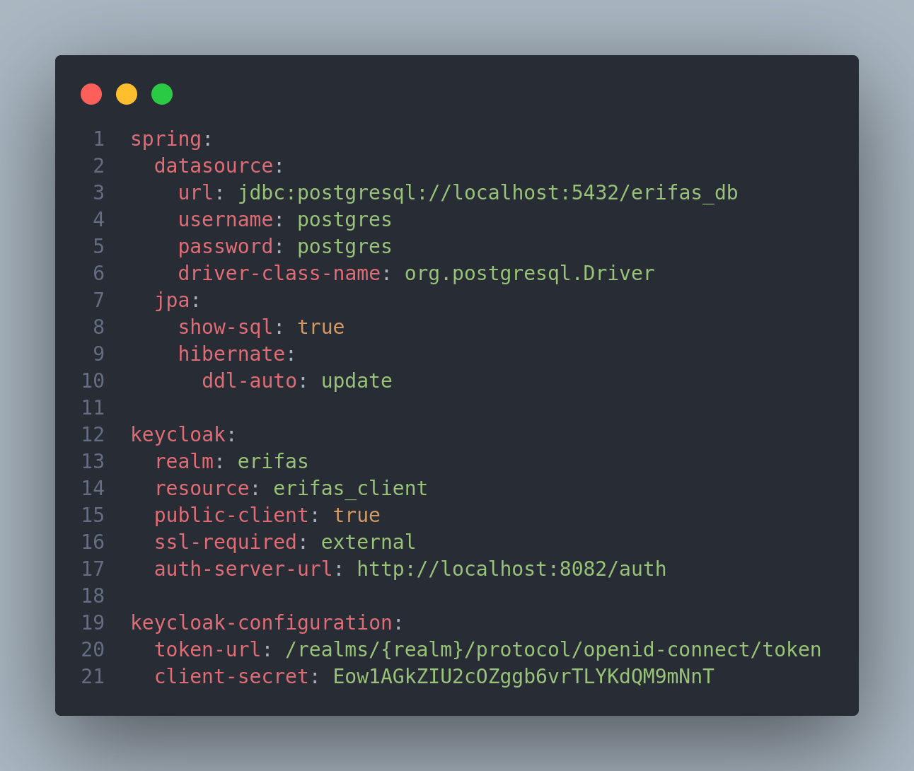

# Reutilização de Software

## Histórico de Versões

| Data   | Versão | Descrição                                               | Autor(es)       |
|--------|--------|---------------------------------------------------------|-----------------|
| 29-Jan | 0.1    | Redação de Introdução                                   | Guilherme Brito |
| 29-Jan | 1.0    | Inclusão de tópicos faltantes e Finalização do Artefato | Guilherme Brito |

### Participantes do Artefato

- Guilherme Brito (Autor)

## 1. Introdução

Este documento tem por objetivo abordar o tópico de Reutilização de Software no contexto do trabalho desenvolvido
durante esse semestre letivo. Neste documento, serão abordados alguns tópicos como: Frameworks e bibliotecas utilizadas
e implementações que favorecem uma escrita mais rápida e assertiva de código e consequentemente a implementação de novas
features em menos tempo.

### 1.1 - Reutilização de Software

O objetivo da reutilização de software é evitar retrabalho no desenvolvimento de um novo projeto, levando em
consideração trabalhos anteriores, fazendo com que soluções previamente desenvolvidas sejam aproveitadas e implementadas
em novos contextos. [1]

A principal motivação para a **reutilização** está relacionada ao aumento dos níveis de qualidade e produtividade no
desenvolvimento de software.

Atualmente existem diversas técnicas de reuso
como ``frameworks, arquiteturas orientadas a serviços (SOA), engenharia de software baseado em componentes``, entre
outras.

## 2. Aplicação

Neste trabalho, podem ser identificadas as seguintes ferramentas prezando o reuso de software:

### 2.1 - Backend [Spring Boot]

No nível de Backend, o principal framework utilizado foi o ``Spring Boot``.

O Spring Boot é um framework que torna fácil a criação de aplicações Spring autossuficientes e robustas,
possibilitando a execução imediata. Contudo isso só é possível por conta da abordagem opinativa sobre a plataforma
Spring e bibliotecas de terceiros, que permite ao desenvolvedor gastar o mínimo de tempo possível configurando o
projeto, e sim codificando suas regras de negócio. [2]
Dentre as funcionalidades do Spring Boot que favorecem uma rápida implementação de aplicações, estão:

1. A criação de aplicações Spring autossuficientes;
2. Servidores web como o Tomcat, Jetty e Undertow embutidos;
3. Prover starter’s opinativos para gerenciamento de dependências e build;
4. Configuração automática de bibliotecas Spring e de terceiros sempre que possível;
5. Funcionalidades para ambiente de produção como métricas, health checks e configurações externalizadas.
6. Dispensar a necessidade de configuração XML e geração de código.

Um exemplo da utilização dessas funcionalidades, o
arquivo [application.yml](https://github.com/UnBArqDsw2022-2/2022.2_G2-e_Rifas_Backend/blob/main/src/main/resources/application.yml)
abaixo demonstra a utilização de arquivos yml
para a configuração da aplicação:

|                                                                                        |
|:------------------------------------------------------------------------------------------------------------------------:|
| Imagem 1: Arquivo padrão .yml de configuração da Aplicação (Sem necessidade de escrita de código)   Autoria: Própria |

Vale ressaltar que para a utilização das variáveis customizadas para padronização de código, foi criado a
classe ``ApplicationPropperties``.

Juntamente com o uso deste framework, foram utilizadas bibliotecas (definidas no
arquivo [pom.xml](https://github.com/UnBArqDsw2022-2/2022.2_G2-e_Rifas_Backend/blob/main/pom.xml)) para diversos fins.
As mais notáveis são:

> 
Spring Data JPA

~~~xml

<dependencies>
    <dependency>
        <groupId>org.springframework.boot</groupId>
        <artifactId>spring-boot-starter-data-jpa</artifactId>
    </dependency>
</dependencies>
~~~

O Spring Data JPA torna fácil a implementação de repositórios baseados em JPA (Java Persistence API). [3]
Um exemplo de utilização no código pode ser encontrado na utilização da principal interface dessa
biblioteca, sendo ela: ``JpaRepository``.
Na implementação, foi criada uma Interface Base (``BaseJpaRepository``) para todos os repositórios (que possuem acesso a
camada de persistência), a qual extende a
interface JpaRepository.

|||
|:--:|:--:|
|Imagem 2: Interface BaseJpaRepository   Autoria: Própria |Imagem 3: Interface CompradorRepository   Autoria:
Própria |

A BaseJpaRepository também extende a Interface JpaSpecificationExecutor. Ela não foi utilizada, mas apresenta
funcionalidades para implementação de filtros através da interface Specification e oferece suporte à Paginação. Um
exemplo da utilização dessa API pode ser encontrada
neste [link](https://imasters.com.br/back-end/specifications-com-spring-data).

> 
Spring Web

~~~xml

<dependencies>
    <dependency>
        <groupId>org.springframework.boot</groupId>
        <artifactId>spring-boot-starter-web</artifactId>
    </dependency>
</dependencies>
~~~

O Spring Web é adequado para o desenvolvimento de Aplicações Web. É um rico framework "MVC", permitindo que se crie
Controladores para administrarem requisições HTTP.
Na aplicação podem ser encontrados diversos usos, especialmente nas classes Controllers, anotadas com @RestController. (
Vide um exemplo abaixo)

|                                                                                                                                                                   |
|:---------------------------------------------------------------------------------------------------------------------------------------------------------------------------------------------------------------:|
| Imagem 4: Classe [UsuarioController](https://github.com/UnBArqDsw2022-2/2022.2_G2-e_Rifas_Backend/blob/main/src/main/java/com/erifas/backend/resource/controller/UsuarioController.java)   Autoria: Própria |

> 
Spring Webflux

É um módulo que permite trabalhar com programação reativa em aplicações Java com Spring. [4]
Optamos no uso dessa biblioteca para realizar requisições ao serviço externo do Keycloak (Serviço de Autenticação e
Autorização utilizado), pois como se trata de uma aplicação
externa não temos controle da performance dessas requisições. As requisições foram implementadas na classe:
[KeycloakService](https://github.com/UnBArqDsw2022-2/2022.2_G2-e_Rifas_Backend/blob/main/src/main/java/com/erifas/backend/external/keycloak/service/KeycloakService.java).

|                                                                    |
|:------------------------------------------------------------------------------------------------------------:|
| Imagem 5: Fragmento de Classe KeycloakService (Método para Recuperação dos Usuários)   Autoria: Própria. |

> 
Lombok

~~~xml

<dependencies>
    <dependency>
        <groupId>org.projectlombok</groupId>
        <artifactId>lombok</artifactId>
        <optional>true</optional>
    </dependency>
</dependencies>
~~~

O Lombok é uma livraria java focada em produtividade e redução de código boilerplate que, por meio de anotações
adicionadas ao nosso código. [5] Ora, um exemplo **perfeito** de reutilização de código.

Brincadeiras a parte ... Na aplicação, essa ferramenta estava sendo utilizada para evitar código boilerplate (
principalmente Getters e Setters), porém foi encontrado bloqueios e conflitos com o Jackson (Biblioteca para
serialização e deserialização de JSON), logo as anotações ``@Data, @Getter, @Setter`` foram retiradas. Atualmente,
possui uma aplicação: Retirar o atributo do ToString da Entidade Bilhete.

|                                                                                            |
|:----------------------------------------------------------------------------------------------------------------------------------------:|
| Imagem 8: Fragmento de Código da Classe Bilhete (Note a utilização da notação @ToString.Exclude no atributo Rifa)   Autoria: Própria |

### 2.2 - Autenticação [Keycloak]

A Nível de Autenticação e Autorização, foi utilizado a ferramenta Keycloak. o Keycloak é um produto de software de
código aberto para permitir o logon único com gerenciamento de identidade e acesso voltado para aplicações e serviços
modernos. [6]

Foi criado um docker-compose para a gerência dessa aplicação, ao subir, a aplicação é servida na porta 8082.

|                                        |
|:------------------------------------------------------------------------------------:|
| Imagem 9: Fragmento de Docker Compose responsável pela gerência do serviço Keycloak. |

Na aplicação, foi utilizado para o login e cadastro de usuários na aplicação. Adiante, a biblioteca ``keycloak-js`` foi
importada para o frontend para que seja utilizada.

### 2.3 - DevOPS [Docker]

A Ferramenta Docker foi utilizada para garantir a unicidade de ambiente entre todos os desenvolvedores e
concumitantemente uma fácil configuração do mesmo. O Docker é um conjunto de produtos de plataforma como serviço (PaaS)
que usam virtualização de nível de SO para entregar software em pacotes chamados contêineres.

O Docker Compose é uma ferramenta para definição e automação de execução de aplicações Docker multi-containers. Através
de arquivos YAML, é possível a configuração de suas aplicações e consequentemente a montagem de um ambiente, este
arquivo sendo comumente nomeado como ``docker-compose.yaml``. Na aplicação, este arquivo está presente no
diretório ``ambiente`` e para sua execução, basta executar o seguinte comando: ``docker-compose up -d``.

|                                                                   |
|:-----------------------------------------------------------------------------------------------------------------:|
| Imagem 10: Arquivo YAML ``docker-compose up -d`` de configuração de ambiente da aplicação.   Autoria: Própria |

### 2.4 - Frontend [React]

Para o frontend, foi utilizada da biblioteca React.

React é uma biblioteca JavaScript para construção de interfaces de usuário. [8]

O React é um framework baseado em componentes, e um exemplo pode ser visto na imagem abaixo (um componente de Botão
utilizado na aplicação).

|                     |
|:------------------------------------------------------------------:|
| Imagem 11: Componente de Botão construído.   Autoria: Própria. |

Consequentemente, após a construção desse componente, ele pode ser utilizado em uma hierarquia mais complexa, como por
exemplo no componente Form.

|                                                                      |
|:---------------------------------------------------------------------------------------------------------------:|
| Imagem 12: Componente Form. (Note a utilização do Componente: CustomButtom) na linha 51.   Autoria: Própria |

## 3. Conclusão

Através dos diversos exemplos mostrados nesse artefato, foi visto que o conceito de Reutilização de Software pode ser
utilizado nos diversos
níveis de desenvolvimento, desde o mais alto ao mais baixo. Para o desenvolvimento da aplicação E-rifas foi de extrema
importância, pois o prazo foi curto para o desenvolvimento onde tal conceito se encaixou como luva.

# Referências

- [1] - **Reutilização de Software - Revista Engenharia de Software Magazine 39** Disponível
  em: https://www.devmedia.com.br/reutilizacao-de-software-revista-engenharia-de-software-magazine-39/21956
- [2] - **O que é o Spring Boot?** Disponível em: https://www.treinaweb.com.br/blog/o-que-e-o-spring-boot
- [3] - **Spring Data JPA** Disponível em: https://spring.io/projects/spring-data-jpa#overview
- [4] - **Spring Webflux** Disponível em: https://medium.com/@michellibrito/spring-webflux-f611c8256c53
- [5] - **Projeto Lombok: Escrevendo menos código em java** Disponível
  em: https://imasters.com.br/back-end/projeto-lombok-escrevendo-menos-codigo-em-java#:~:text=O%20Lombok%20%C3%A9%20uma%20biblioteca,compila%C3%A7%C3%A3o%20a%20criar%20c%C3%B3digo%20Java.
- [6] **Keycloak** Disponível em: https://en.wikipedia.org/wiki/Keycloak
- [7] **Docker** Disponível em: https://pt.wikipedia.org/wiki/Docker_(software)
-
    - [8] **React: Getting Started** Disponível em: https://pt-br.reactjs.org/docs/getting-started.html