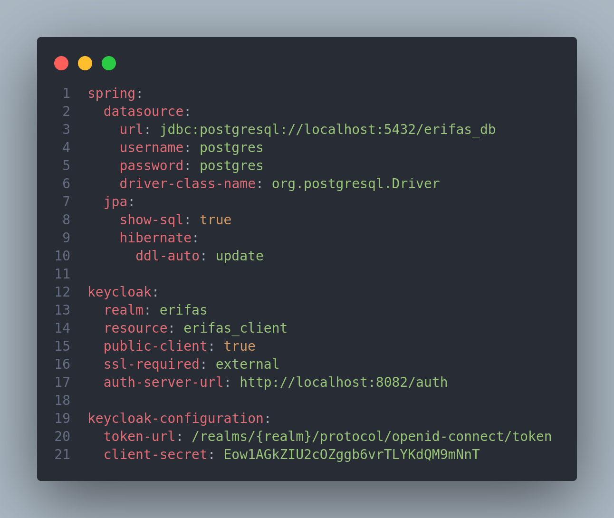
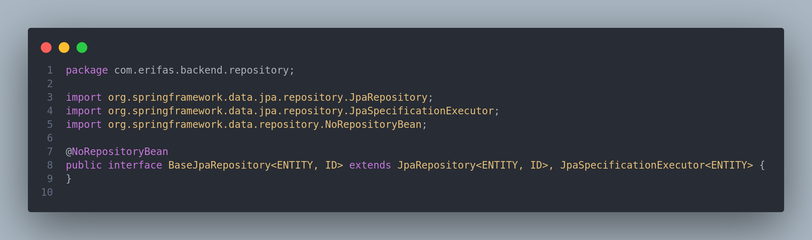
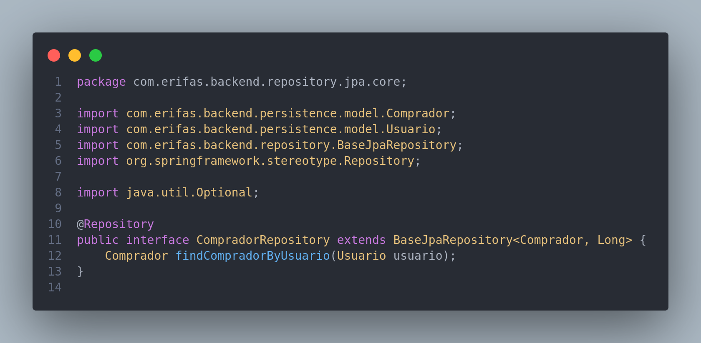
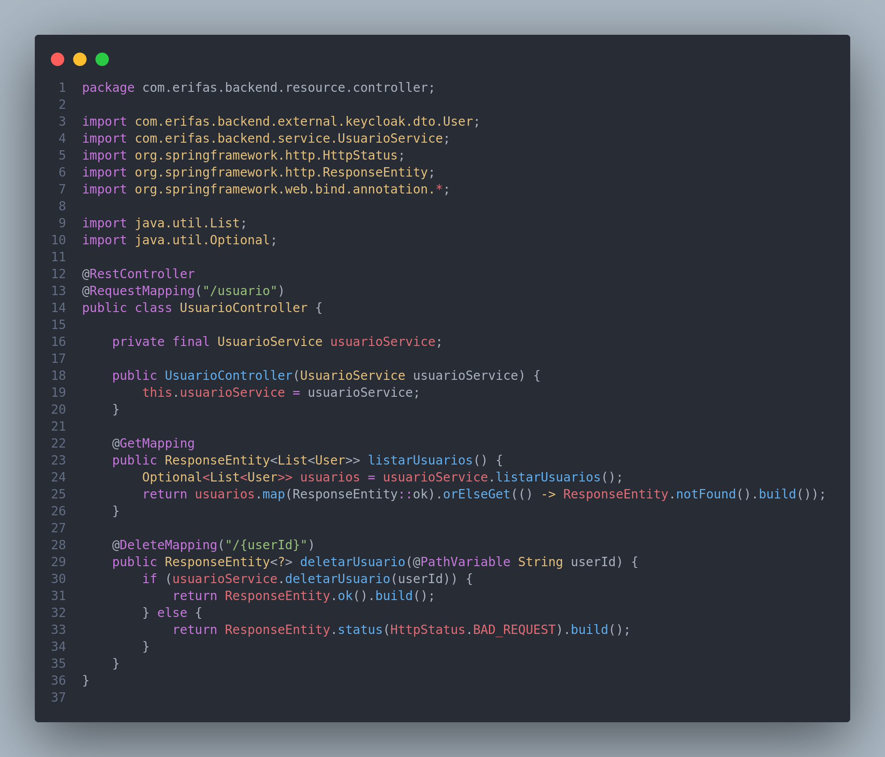
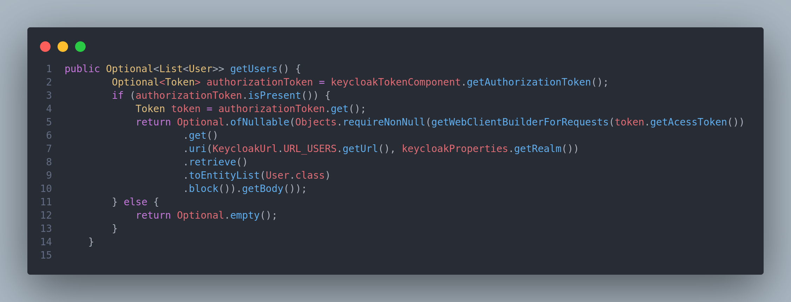

# Reutilização de Software

## Histórico de Versões

| Data   | Versão | Descrição             | Autor(es)       |
|--------|--------|-----------------------|-----------------|
| 29-Jan | 0.1    | Redação de Introdução | Guilherme Brito |

### Participantes do Artefato

- Guilherme Brito (Autor)

## 1. Introdução

Este documento tem por objetivo abordar o tópico de Reutilização de Software no contexto do trabalho desenvolvido
durante esse semestre letivo. Neste documento, serão abordados alguns tópicos como: Frameworks e bibliotecas utilizadas
e implementações que favorecem uma escrita mais rápida e assertiva de código e consequentemente a implementação de novas
features em menos tempo.

### 1.1 - Reutilização de Software

O objetivo da reutilização de software é evitar retrabalho no desenvolvimento de um novo projeto, levando em
consideração trabalhos anteriores, fazendo com que soluções previamente desenvolvidas sejam aproveitadas e implementadas
em novos contextos. [1]

A principal motivação para a **reutilização** está relacionada ao aumento dos níveis de qualidade e produtividade no
desenvolvimento de software.

Atualmente existem diversas técnicas de reuso
como ``frameworks, arquiteturas orientadas a serviços (SOA), engenharia de software baseado em componentes``, entre
outras.

## 3. Aplicação

Neste trabalho, podem ser identificadas as seguintes ferramentas prezando o reuso de software:

### 3.1 - Backend

No nível de Backend, o principal framework utilizado foi o ``Spring Boot``.

O Spring Boot é um framework que torna fácil a criação de aplicações Spring autossuficientes e robustas,
possibilitando a execução imediata. Contudo isso só é possível por conta da abordagem opinativa sobre a plataforma
Spring e bibliotecas de terceiros, que permite ao desenvolvedor gastar o mínimo de tempo possível configurando o
projeto, e sim codificando suas regras de negócio. [2]
Dentre as funcionalidades do Spring Boot que favorecem uma rápida implementação de aplicações, estão:

1. A criação de aplicações Spring autossuficientes;
2. Servidores web como o Tomcat, Jetty e Undertow embutidos;
3. Prover starter’s opinativos para gerenciamento de dependências e build;
4. Configuração automática de bibliotecas Spring e de terceiros sempre que possível;
5. Funcionalidades para ambiente de produção como métricas, health checks e configurações externalizadas.
6. Dispensar a necessidade de configuração XML e geração de código.

Um exemplo da utilização dessas funcionalidades, o
arquivo [application.yml](https://github.com/UnBArqDsw2022-2/2022.2_G2-e_Rifas_Backend/blob/main/src/main/resources/application.yml)
abaixo demonstra a utilização de arquivos yml
para a configuração da aplicação:

|                                                                                                       |
|:------------------------------------------------------------------------------------------------------------------------:|
| Imagem 1: Arquivo padrão .yml de configuração da Aplicação (Sem necessidade de escrita de código)   Autoria: Própria |

Vale ressaltar que para a utilização das variáveis customizadas para padronização de código, foi criado a
classe ``ApplicationPropperties``.

Juntamente com o uso deste framework, foram utilizadas bibliotecas (definidas no
arquivo [pom.xml](https://github.com/UnBArqDsw2022-2/2022.2_G2-e_Rifas_Backend/blob/main/pom.xml)) para diversos fins.
As mais notáveis são:

> 
Spring Data JPA

~~~xml

<dependencies>
    <dependency>
        <groupId>org.springframework.boot</groupId>
        <artifactId>spring-boot-starter-data-jpa</artifactId>
    </dependency>
</dependencies>
~~~

O Spring Data JPA torna fácil a implementação de repositórios baseados em JPA (Java Persistence API). [3]
Um exemplo de utilização no código pode ser encontrado na utilização da principal interface dessa
biblioteca, sendo ela: ``JpaRepository``.
Na implementação, foi criada uma Interface Base (``BaseJpaRepository``) para todos os repositórios (que possuem acesso a
camada de persistência), a qual extende a
interface JpaRepository.

|||
|:--:|:--:|
|Imagem 2: Interface BaseJpaRepository   Autoria: Própria |Imagem 3: Interface CompradorRepository   Autoria:
Própria |

A BaseJpaRepository também extende a Interface JpaSpecificationExecutor. Ela não foi utilizada, mas apresenta
funcionalidades para implementação de filtros através da interface Specification e oferece suporte à Paginação. Um
exemplo da utilização dessa API pode ser encontrada
neste [link](https://imasters.com.br/back-end/specifications-com-spring-data).

> 
Spring Web

~~~xml

<dependencies>
    <dependency>
        <groupId>org.springframework.boot</groupId>
        <artifactId>spring-boot-starter-web</artifactId>
    </dependency>
</dependencies>
~~~

O Spring Web é adequado para o desenvolvimento de Aplicações Web. É um rico framework "MVC", permitindo que se crie
Controladores para administrarem requisições HTTP.
Na aplicação podem ser encontrados diversos usos, especialmente nas classes Controllers, anotadas com @RestController. (
Vide um exemplo abaixo)

|                                                                                                                                                                   |
|------------------------------------------------------------------------------------------------------------------------------------------------------------------------------------------|
| Imagem 4: Classe [UsuarioController](https://github.com/UnBArqDsw2022-2/2022.2_G2-e_Rifas_Backend/blob/main/src/main/java/com/erifas/backend/resource/controller/UsuarioController.java) |

> 
Spring Webflux

É um módulo que permite trabalhar com programação reativa em aplicações Java com Spring. [4]
Optamos no uso dessa biblioteca para realizar requisições ao serviço externo do Keycloak (Serviço de Autenticação e
Autorização utilizado), pois como se trata de uma aplicação
externa não temos controle da performance dessas requisições. As requisições foram implementadas na classe:
[KeycloakService](https://github.com/UnBArqDsw2022-2/2022.2_G2-e_Rifas_Backend/blob/main/src/main/java/com/erifas/backend/external/keycloak/service/KeycloakService.java).

|                                                               |
|:------------------------------------------------------------------------------------:|
| Imagem 5: Fragmento de Classe KeycloakService (Método para Recuperação dos Usuários) |

> 
Lombok

~~~xml

<dependencies>
    <dependency>
        <groupId>org.projectlombok</groupId>
        <artifactId>lombok</artifactId>
        <optional>true</optional>
    </dependency>
</dependencies>
~~~

# Referências

- [1] - **Reutilização de Software - Revista Engenharia de Software Magazine 39** Disponível
  em: https://www.devmedia.com.br/reutilizacao-de-software-revista-engenharia-de-software-magazine-39/21956
- [2] - **O que é o Spring Boot?** Disponível em: https://www.treinaweb.com.br/blog/o-que-e-o-spring-boot
- [3] - **Spring Data JPA** Disponível em: https://spring.io/projects/spring-data-jpa#overview
- [4] - **Spring Webflux** Disponível em: https://medium.com/@michellibrito/spring-webflux-f611c8256c53