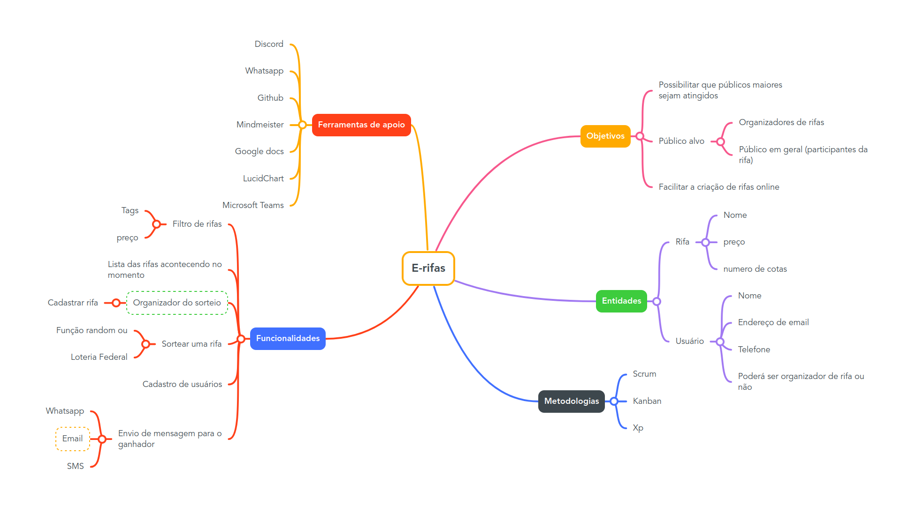

# Mapa Mental

## Historico de versão

|Data|Versão|Descrição|Autor(es)|
|----|------|---------|---------|
|16/11/2022| 1.0 |Criação da versão 1 do mapa mental | André Alves |
|17/11/2022| 1.1 | Criação do documento e adição do mapa mental | André Alves |

## Metodologia

O Mapa Mental é um diagrama utilizado para organizar as informações visualmente em uma estrutura hierárquica, relacionando cada um dos tópicos.

É comumente criado a partir de uma único conceito no centro de uma página em branco ao qual vão sendo adicionadas ideias associadas à esse tópico central. Os tópicos adjacentes podem ser imagens, palavras, conceitos, entre outros. As ideias principais são diretamente ligadas ao tópico central e vão se ramificando em tópicos e conceitos mais específicos, formando uma estrutura análoga a uma árvore (que parte de uma raiz e se ramifica até chegar nas folhas).

## Ferramentas utilizadas

- Mindmeister (Criação do mapa mental)
- Microsoft Teams (Gravação do brainstorming)

## Resultado

A versão inicial do mapa mental foi realizada durante uma reunião no dia 16 de novembro de 2022 juntamente com a realização da gravação do Brainstorming, onde o grupo se reuniu para levantar ideias, funcionalidades e entender a regra de negócio do aplicativo que será desenvolvido e após essa reunião, o aluno André Alves ficou responsável por concluir o mapa mental a partir do que foi levantado durante o Brainstorming, organizando melhor os dados e estruturando as ideias.

<figcaption>Mapa Mental v.1</figcaption>

<figcaption>Autor: André Alves</figcaption>

## Referências

https://en.wikipedia.org/wiki/Mind_map