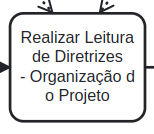
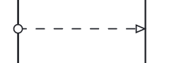

# Processos Envolvidos no Desenvolvimento do Trabalho

### Participantes do Artefato

- Guilherme Brito

## 1. Introdução

Neste documento, será dissertado um pouco sobre a importância do BPMN (Business Process Management Notation) para melhor
gerência do fluxo do desenvolvimento.
Além disso, será mostrado como os diagramas construídos, a partir dessa notação, foram utilizados.

## 2. Metodologia

Todo desenvolvimento precisa, periodicamente, repensar seus processos para melhorar a gestão seus processos. Uma das
maneiras de fazer isso é utilizando recursos de modelagem. [1]

A modelagem de processos permite a identificação de cada atividade e de seus desdobramentos envolvidos nos seus fluxos.
Assim, é possível ter a visão dos autores dos processos, das atividades, tarefas, subprocessos e também de toda a
conexão com os fluxos dentro da entrega de valor do seu negócio.

## 3. Aplicação

Neste trabalho, o BPMN foi utilizado para a construção do fluxo de desenvolvimento que estará presente durante toda a
sua vida útil. Para a construção dos diagramas, foi utilizado da Ferramenta Camunda, por meio da sua funcionalidade
Camunda Modeler.

### Legendas

No Diagrama, foram utilizados elementos específicos dependendo do seu fim. Os elementos e seus significados estão
presentes na tabela a seguir.

|                              Elemento                               |                                                 Indicação                                                  |
| :-----------------------------------------------------------------: | :--------------------------------------------------------------------------------------------------------: |
|  |                                       Indica o início de um processo                                       |
|                          |                              Indica uma tarefa a ser executada por algum ator                              |
|                  |                                 Indica um Provedor de Dados (Educacional)                                  |
|             |                       Indica um arquivo consultável presente em ambiente educacional                       |
|                                 |     Indica que alguma pergunta será feita, e dependendo da resposta, um caminho diferente será seguido     |
|                              |                             Indica um comentário sobre alguma fase do Processo                             |
|                                      |                         Indica que o Github será utilizado como Provedor de Dados                          |
|                                        | Indica o envio de mensagem para algum destinatário (Pode ser utilizado qualquer ferramenta de comunicação) |
|                            | Indica que ao passar por esse elemento, o processo será paralelizado. (Uma seta apontando para o elemento) |
|                           |      Indica que o processo, antes paralelizado, será mergeado (Duas setas apontando para o elemento)       |
|                         |                        Indica um arquivo consultável elaborado pela própria equipe                         |
|                     |                       Indica uma relação de sequência entre dois processos distintos                       |
|                  |                     Indica um arquivo consultável disponível em outras fontes onlines                      |
|                         |                         Indica um agrupamento de fluxo com propósitos semelhantes                          |
|                   |               Elemento que engloba um processo para indicar seu domínio e seus participantes               |
|                         |                                      Indica a finalização do processo                                      |

> Tabela 1: Elementos do BPMN e seus Significados -> Autor: Guilherme Brito Vilas - Bôas

### 3.1 - Processo de Sprint (Visão Macro)

No diagrama abaixo, é possível visualizar, em um aspecto macro, como funcionará o processo de desenvolvimento como
todo (Cada Sprint seguirá esse modelo).

<iframe src="https://modeler.cloud.camunda.io/embed/325ab50d-9ddd-4627-8654-9b06af183a4f" style="width:700px;height:500px;border:1px solid #ccc" allowfullscreen></iframe>

> Diagrama 1: FLuxo Processual de Sprint -> Autor: Guilherme Brito Vilas - Bôas

### 3.1.1 - Processo de Sprint Planning

Como explicado no documento de Metodologias Adotadas, o processo de Sprint Planning será adotado pelo grupo onde ele foi
modelado conforme o diagrama abaixo.

<iframe src="https://modeler.cloud.camunda.io/embed/bcacc039-0a37-4de7-bb23-1cbc1b26fc66" style="width:700px;height:500px;border:1px solid #ccc" allowfullscreen></iframe>

> Diagrama 2: Fluxo Processual de Sprint Planning -> Autor: Guilherme Brito Vilas - Bôas

### 3.1.2 - Processo de Desenvolvimento

O Desenvolvimento e Implementação das Issues se dará pelo seguinte diagrama abaixo.

<iframe src="https://modeler.cloud.camunda.io/embed/2fa059a0-04f9-4bf5-ad35-070e88fdfcc3" style="width:700px;height:500px;border:1px solid #ccc" allowfullscreen></iframe>

> Diagrama 3: Fluxo Processual de Implementação de Issue -> Autor: Guilherme Brito Vilas - Bôas

### 3.1.3 - Processo de Sprint Review

O Processo de Sprint Review modelado pode ser visualizado no diagrama abaixo.

<iframe src="https://modeler.cloud.camunda.io/embed/02762bb7-a16e-4ae3-a522-6a0cfc7078cb" style="width:700px;height:500px;border:1px solid #ccc" allowfullscreen></iframe>

> Diagrama 4: Fluxo Processual de Sprint Review -> Autor: Guilherme Brito Vilas - Bôas

## Referências

- [1] - **Modelagem de Processos para os Negócios** Disponível
  em: https://www.lecom.com.br/blog/modelagem-de-processo-para-os-negocios

## Histórico de Versões

| Data   | Versão | Descrição                         | Autor(es)       |
| ------ | ------ | --------------------------------- | --------------- |
| 16-Nov | 0.1    | Construção da Página              | Guilherme Brito |
| 22-Dec | 0.2    | Formatação e correção ortográfica | João Paulo Lima |
