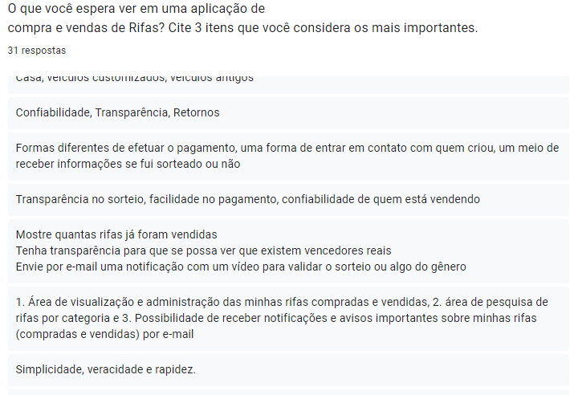

# Questionário

## 1. Introdução

A utilização de questionários como forma de técnica de elicitação de requisitos é interessante pois permite com que a equipe colete dados de um grande número de pessoas com um esforço reduzido. 

Além disso, o uso desta técnica permite com que a equipe, além de coletar dados para auxiliar na elicitação de requisitos, possa coletar dados demográficos sobre seus potenciais usuários. Assim, gerando mais fontes de informação para a elaboração do [Perfil do Usuário](Base/personas-perfilUsuario.md).

## 2. Metodologia

Para a realização do questionário, a equipe optou por utilizar a ferramenta Google Forms. E com o ojetivo de alcançar o maior número de potenciais usuários o possível, a equipe enviou este questionário em grupos de whatsapp que consideravamos ser condizentes com o perfil de usuário que buscavamos. Desta forma, 3 dias após enviarmos o quesitonário conseguimos 31 reposta.

## 3. Perguntas

### 3.1 Pergunta 1

Figura 1: Pergunta 1 questionário   -> Fonte: Elaboração própria

### 3.2 Pergunta 2

Figura 2: Pergunta 2 questionário   -> Fonte: Elaboração própria

### 3.3 Pergunta 3

Figura 3: Pergunta 3 questionário   -> Fonte: Elaboração própria

### 3.4 Pergunta 4

Figura 4: Pergunta 4 questionário   -> Fonte: Elaboração própria

### 3.5 Pergunta 5

Figura 5: Pergunta 5 questionário   -> Fonte: Elaboração própria

### 3.6 Pergunta 6

Figura 6: Pergunta 6 questionário   -> Fonte: Elaboração própria

### 3.7 Pergunta 7

Figura 7: Pergunta 7 questionário   -> Fonte: Elaboração própria

### 3.8 Pergunta 8

Figura 8: Pergunta 8 questionário   -> Fonte: Elaboração própria

### 3.9 Pergunta 9

Figura 9: Pergunta 9 questionário   -> Fonte: Elaboração própria

### 3.10 Pergunta 10

Figura 10: Pergunta 10 questionário   -> Fonte: Elaboração própria

### 3.11 Pergunta 11

Figura 11: Pergunta 11 questionário   -> Fonte: Elaboração própria

### 3.12 Pergunta 12

Figura 12: Pergunta 12 questionário   -> Fonte: Elaboração própria

## 4. Resultado

A partir das respostas recebidas conseguimos chegar aos seguintes requisitos:

| ID  | Requisito                                                                               | 
| --- | --------------------------------------------------------------------------------------- | 
| Q01 | O usuário deve conseguir                       | 

## Referências

- BARBOSA, Simone; SILVA, Bruno. Interação Humano Computador. Rio de Janeiro. Elsevier Editora Ltda. 2010

## Histórico de Versões

| Data   | Versão | Descrição            | Autor(es)       | Revisor(es)|
|--------|--------|----------------------|-----------------|-------------|
| 02-Nov | 0.1    | Construção da Página | Lucas Pimentel |  |
| 02-Nov | 0.2    | Adicona introdução e perguntas | Lucas Pimentel |  |