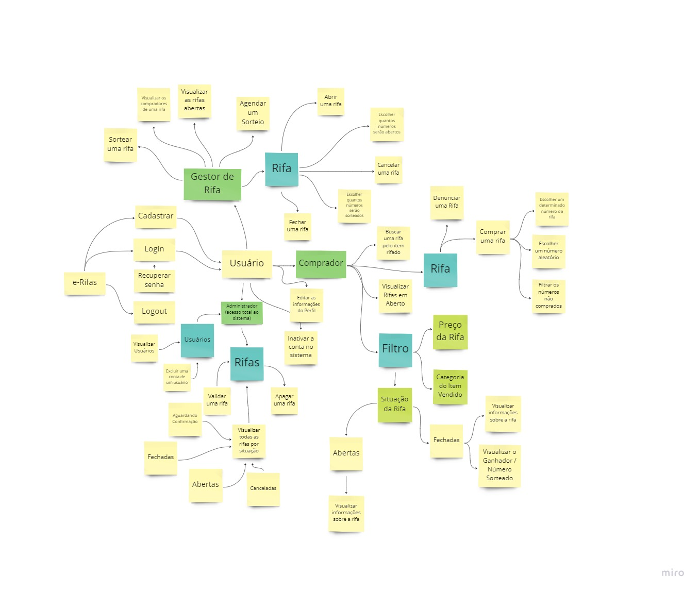

# Brainstorming

## 1. Introdução

De acordo com Barbosa (2010), brainstorming é uma técnica utilizada para levantar requisitos e aprender sobre características que os usuários gostariam no sistema. Sendo assim, a sessão de brainstorming é bastante livre, onde a equipe levanta um conjunto grande de ideias e opiniões.

Além disso, existem algumas regras sugeridas para uma sessão de brainstorming, como:

- Todas as ideias são válidas e os participantes não devem censurar a si próprios ou aos outros.
- Os participantes não devem tentar projetar ou construir o sistema.
- Os participantes devem fazer perguntas sobre sugestõoes duplicadas, é possível que uma ideia que se pareça com outra já mencionada não seja exatamente igual.

## 2. Metodologia

A partir disso, para a execução da sessão de brainstorming deste projeto, a equipe optou por se reunir por [Discord](Base/metodologiasAdotadas.md) e foi realizada uma sessão de cerca de 40 minutos. Para o maior proveito da reunião, seguimos as regras sugeridas para a realização de um brainstorm, dessa forma, todas as ideias sugeridas foram aceitas e adicionadas em um quadro esquemático para uma melhor organização. O quadro com as ideias de requisitos levantadas durante a reunião pode ser encontrado abaixo:

Figura 1: Quadro de brainstorm   -> Fonte: Elaboração própria.

## 3. Partcipantes

Os membros da equipe que participaram da reunião de brainstorm foram:

- Lucas Pimentel
- Guilherme Brito
- Eurico Abreu
- João Paulo Lima
- Karla Feliciano
- Jackes da Fonseca
- André Alves
- Arthur Melo
- Marcos Cabeceira
- Erick Melo
- Eliás Yousef

## 4. Resultado

A partir da sessão de brainstorming, conseguimos elicitar os seguintes requisitos:

|  ID  |                                Requisitos                                 |
| :--: | :---------------------------------------------------------------------------------: |
| BS01 |                        O usuário deve poder criar uma conta                         |
| BS02 |   O usuário deve poder fazer login em uma conta           |
| BS03 |     O usuário deve poder fazer logout em uma conta            |
| BS04 |     O usuário deve poder recuperar a senha de sua conta        |
| BS05 |    O usuário deve poder editar as informações cadastradas em sua conta         |
| BS06 |   O usuário administrador deve poder exlcuir uma conta          |
| BS07 |   O usuário administrador deve poder visualizar uma lista de usuários cadastrados          |
| BS08 |   O usuário deve poder inativar sua conta no sistema          |
| BS09 |   O usuário deve poder sortear uma rifa          |
| BS010 |  O usuário deve poder visualizar os compradores de uma rifa           |
| BS011 |  O usuário  deve poder visualizar suas rifas abertas           |
| BS012 |  O usuário deve poder agendar um sorteio        |
| BS013 |  O usuário deve poder abrir uma rifa           |
| BS014 |  O usuário deve poder escolher quantos números serão sorteados           |
| BS015 |  O usuário deve poder cancelar uma rifa           |
| BS016 |  O usuário deve poder escolher quantos números serão abertos           |
| BS017 |  O usuário deve poder fechar uma rifa           |
| BS018 |  O usuário deve poder buscar uma rifa pelo item rifado           |
| BS019 | O usuário deve poder visualizar rifas em aberto            |
| BS020 | O usuário deve poder denunciar uma rifa          |
| BS021 | O usuário deve poder escolher um determinado número da rifa para comprar          |
| BS022 | O usuário deve poder escolher um número aleatório para comprar          |
| BS023 | O usuário deve poder filtrar os números não comprados          |
| BS024 | O usuário deve poder filtrar rifas pelo preço          |
| BS025 | O usuário deve poder filtrar rifas pela categoria do item vendido          |
| BS026 | O usuário deve poder filtrar rifas pela situação da Rifa (Aberta ou Fechada)          |
| BS027 | O usuário deve poder visulizar informações sobre rifas abertas e fechadas          |
| BS028 | O usuário deve poder visualizar o ganhador e o número sorteado de rifas fechadas          |
| BS029 | O usuário administrador deve poder validar uma rifa           |
| BS030 | O usuário administrador deve poder apagar uma rifa               |
| BS031 | O usuário administrador deve poder visualizar todas as rifas por situação (Abertas, Fechadas, Aguardando confirmação e Canceladas)            |

## Referências

- BARBOSA, Simone; SILVA, Bruno. Interação Humano Computador. Rio de Janeiro. Elsevier Editora Ltda. 2010
- COURAGE, Catherine; BAXTER, Kathy. Understanding Your Users: A pratical guide to user requirements methods, tools and techniques. 2005

## Histórico de Versões

| Data   | Versão | Descrição            | Autor(es)       | Revisor(es)|
|--------|--------|----------------------|-----------------|-------------|
| 01-Dec | 0.1    | Construção da Página | Lucas Pimentel | Eurico Abreu |
| 02-Dec | 0.2    | Adiciona resultados | Lucas Pimentel | Eurico Abreu |
| 02-Dec | 0.3    | Documento revisado | Eurico Abreu | - |
