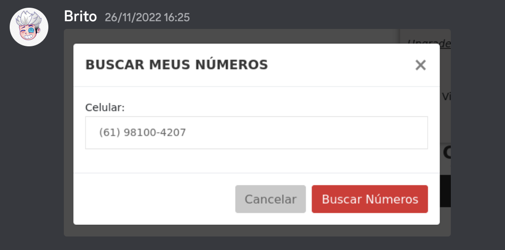
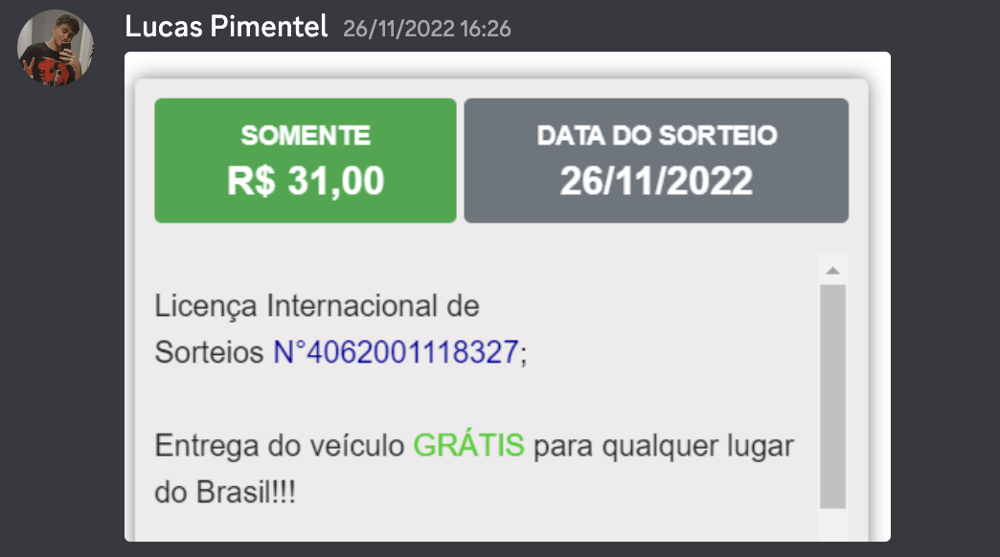
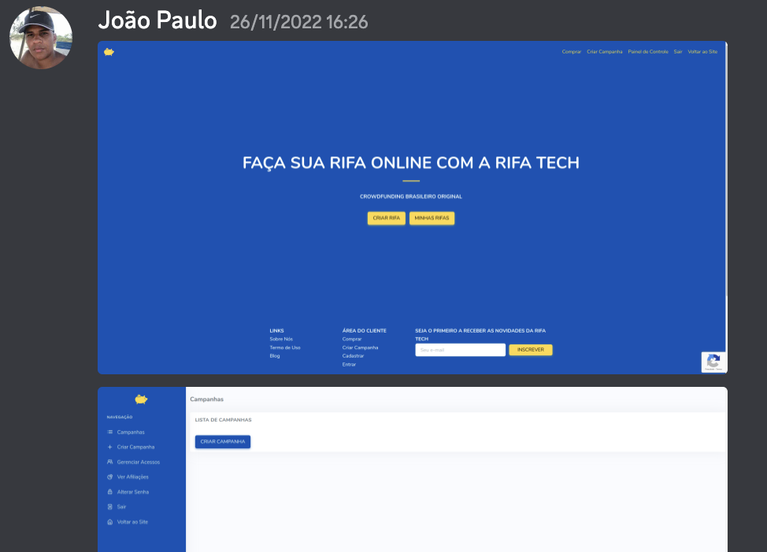

# Observação

## Histórico de Versão

| Data   | Versão | Descrição                 | Autor(es)    | Revisor(es) |
| ------ | ------ | ------------------------- | ------------ | ----------- |
| 02-Dec | 0.1    | Adição do documento       | Eurico Abreu | João Paulo  |
| 02-Dec | 0.2    | Adição das imagens        | Eurico Abreu | João Paulo  |
| 02-Dec | 0.3    | Adição do conteúdo        | Eurico Abreu | João Paulo  |
| 02-Dec | 0.4    | Correção solicitada no PR | Eurico Abreu | -           |

## 1. Introdução

&emsp;&emsp; A observação é uma técnica de elicitação de requisitos onde o engenheiro observa em um ambiente semelhante que o software será implantado, as tarefas sendo executadas, onde se obtém os requisitos, analisando essas tarefas.

## 2. Metodologia

&emsp;&emsp; A metodologia adotada para realizar a observação foi a seguinte, todos os integrantes do grupo se reuniram no [Discord](Base/metodologiasAdotadas.md) e durante essa reunião, entramos em alguns sites de rifas já existentes e realizamos as principais tarefas e atividades desenvolvidas por um usuário comum. Durante esse processo, foram registradas as principais ações por meio de printscreens que foram documentados no chat do Discord.

## 3. Observação em prática

&emsp;&emsp; Seção dedicada para expor como foi realizada a técnica de observação.

Figura 1 -> Fonte: https://mk7projects.com/

Figura 2 -> Fonte: https://mk7projects.com/

Figura 3 -> Fonte: https://rifatech.com/

## 4. Resultados

|  ID   |                                 Requisitos Funcionais                                  |
| :---: | :------------------------------------------------------------------------------------: |
| OBS01 |                          O usuário deve poder abrir uma rifa                           |
| OBS02 |             O usuário deve poder escolher quantos números serão sorteados              |
| OBS03 |                          O usuário deve poder fechar uma rifa                          |
| OBS04 |                    O usuário deve poder visualizar rifas em aberto                     |
| OBS05 |        O usuário deve poder escolher um determinado número da rifa para comprar        |
| OBS06 |             O usuário deve poder escolher um número aleatório para comprar             |
| OBS07 |       O usuário deve poder visualizar informações sobre rifas abertas e fechadas       |
| OBS08 |                O usuário deve poder ver a data do resultado de uma rifa                |
| OBS01 |               O usuário deve poder ver informações do item sendo rifado                |
| OBS10 | O usuário deve ter acesso a alguma forma de contato com a pessoa responsável pela rifa |
| OBS11 |                 O usuário deve poder pagar uma rifa de diversas formas                 |
| OBS12 |        O usuário deve poder reservar um número da rifa e pagar em outro momento        |
| OBS13 |                 O usuário deve poder alterar os seus dados cadastrais                  |

<figcaption align='center'>
    <b>Tabela 1: Requisitos Funcionais  </b>
     <small> Fonte: Elaboração Própria </small>
</figcaption>

|  ID   |                           Requisitos Não Funcionais                           |
| :---: | :---------------------------------------------------------------------------: |
| OBS14 | O sistema deve permitir a navegação pelo app sem a necessidade de um cadastro |
| OBS15 |                O pagamento pelo app deve ser simples e rápido                 |
| OBS16 |        O sistema deve ter um tempo de resposta de no máximo 2 segundos        |

<figcaption align='center'>
    <b>Tabela 2: Requisitos Não Funcionais  </b>
     <small> Fonte: Elaboração Própria </small>
</figcaption>

## Referências

- AURUM, Aybuke; WOHLIN, Claes. Engineering and Managing Software Requirements. Springer, 2005
