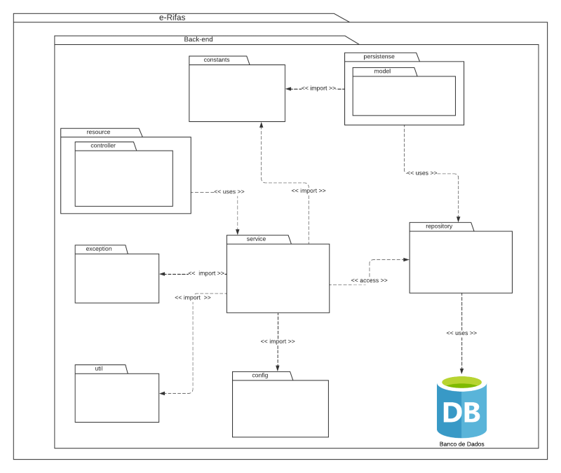
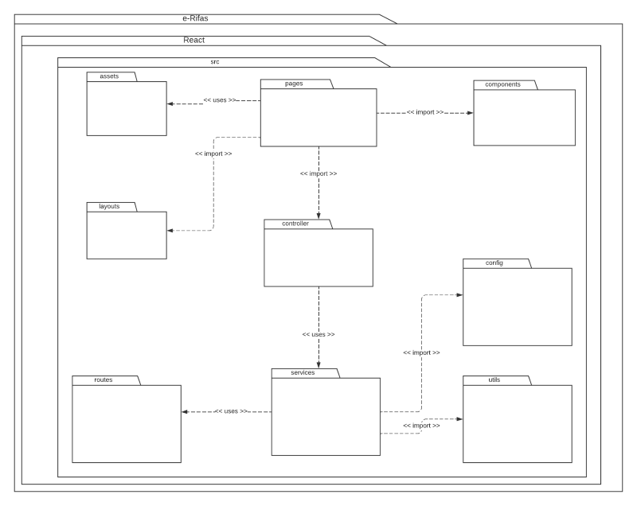
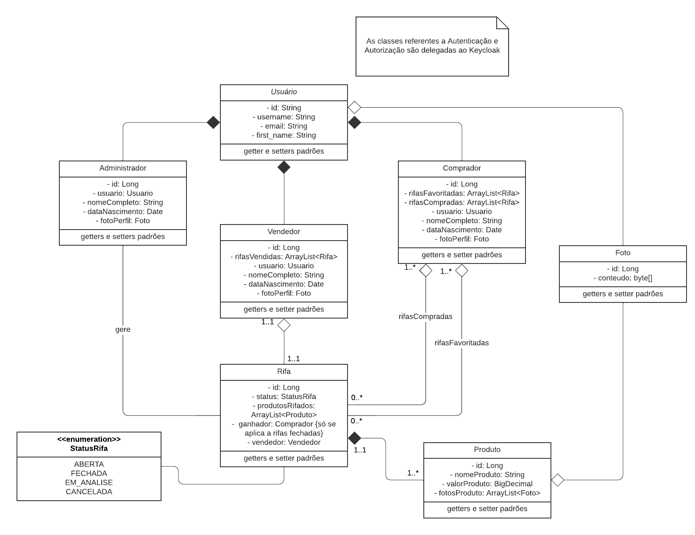
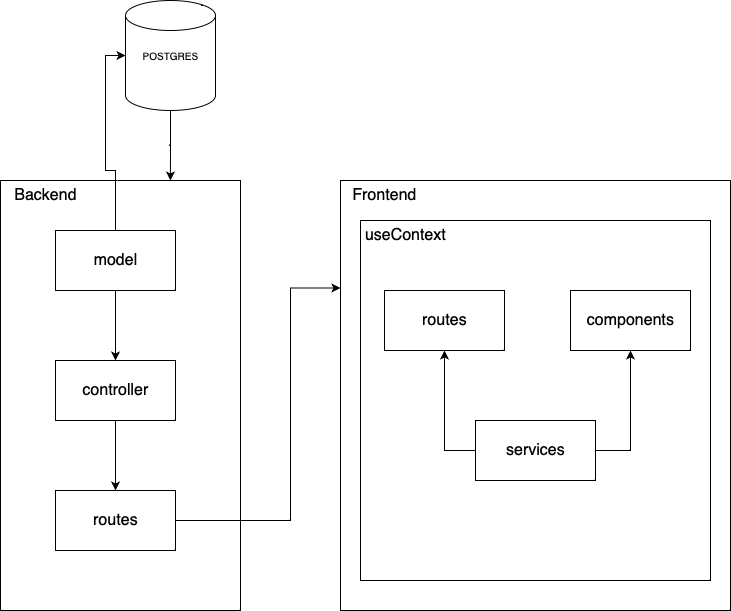

# Documento de Arquitetura (DAS)

## Histórico de Versões

| Data  | Versão | Descrição                            | Autor(es)  | Revisor(es) |
| ----- | ------ | ------------------------------------ | ---------- | ----------- |
| 29-01 | 1.0    | Criação do documento                 | Eurico     | Lucas       |
| 29-01 | 1.1    | Estrutura do documento               | Lucas      | Eurico      |
| 29-01 | 1.2    | Visão de implantação e implementação | Eurico     | Lucas       |
| 29-01 | 1.3    | Representação arquitetural           | Lucas      | Eurico      |
| 29-01 | 1.4    | Introdução e Visão Lógica            | Karla      | João Paulo  |
| 30-01 | 1.5    | Metas e Restrições da Arquitetura    | Lucas      | Eurico      |
| 30-01 | 1.6    | Visão de Processos                   | Jackes     | João Paulo  |
| 30-01 | 1.7    | Requisitos Mínimos                   | João Paulo |             |

## 1. Introdução

### 1.1 Propósito

Esse documento apresenta uma visão geral da arquitetura do sistema E-Rifas, utilizando diferentes visões arquiteturais para retratar os diferentes aspectos do sistema. A intenção é capturar e transmitir as decisões de arquitetura significativas que foram feitas durante o processo de construção do sistema.

A utilização deste documento pode ser feita tanto por usuários, caso queiram entender melhor o funcionamento do sistema e consultar informações em um só lugar, quanto para os desenvolvedores, que precisarão seguir os padrões e modelos estabelecidos aqui para desenvolver o sistema de forma uniforme.

### 1.2 Escopo

O E-Rifas é um sistema que visa facilitar a compra e venda de rifas online. É possível para um vendedor anunciar diversos produtos que são vendidos através de bilhetes de rifa, e ao final sorteado para um ganhador. E para o comprador, é possível encontrar diversos tipos de rifas em um lugar, e filtrar de acordo com seus interesses.

O Documento de Arquitetura descreve como é projetada a estrutura desse sistema, reunindo informações em tipos de visões, assim como a representação arquitetural e aspectos como tamanho, performance e qualidade, o que facilita a manutenção e desenvolvimento do sistema.

### 1.3 Definições, Acrônimos e Abreviações

Os termos, definições, acrônimos e abreviações necessários para entender e interpretar o projeto e o documento devidamente pode ser encontrado no documento de **[Léxicos](Base/artefatos-design-sprint/lexicos.md)**, realizado na fase Base do desenvolvimento do projeto.

### 1.4 Visão Geral

Para facilitar o entendimento, o documento de arquitetura é dividido da seguinte forma:

- [Representação Arquitetural](#_2-representação-arquitetural): descreve a arquitetura de software do sistema e como é representado.
- [Metas e Restrições da Arquitetura](#_3-metas-e-restrições-da-arquitetura): descreve os objetivos e requisitos do software.
- [Visão de Casos de Uso](#_4-visões-de-caso-de-uso): lista os casos de uso ou cenários das funcionalidades do sistema.
- [Visão Lógica](#_5-visão-lógica): descreve as partes arquiteturais significantes dos modelos de design.
- [Visão de Processos](#_6-visão-de-processos): descreve a decomposição do sistema em processos leves ou pesados.
- [Visão de Implantação](#_7-visão-de-implantação): descreve as configurações físicas (hardware).
- [Visão de Implementação](#_8-visão-de-implementação): descreve a estrutura geral do modelo de implementação.
- [Visão de Dados](#_9-visão-de-dados): descreve a camada de persistência do sistema.
- [Tamanho e Performance](#_10-tamanho-e-performance): descreve as características de dimensão do software.
- [Qualidade](#_11-qualidade): descreve como a arquitetura de software contribui para todas as capacidades do sistema.

## 2. Representação Arquitetural

### 2.1. Backend

> Figura 1: Logo Spring. Fonte: https://spring.io .

Para o desenvolvimento da backend da aplicação, optamos por utilizar Java com o framework Spring Boot. Sendo assim, o Spring Boot é uma parte especializada do Spring Framework, que por sua vez é um framework que oferece uma programação e um modelo de configuração mais compreensivo para aplicações Java. A escolha da equipe em relação ao Spring Boot se deu em parte pela experiência prévia de alguns membros com a configuração do ambiente e desenvolvimento de aplicações com o framework e, também, pelo framework permitir o desenvolvimento de aplicações de alta qualidade com menores esforços de configuração e deploy.

No quesito arquitetural, o Spring Boot consiste de 4 camadas: Camada de Apresentação, Camada de Negócio, Camada de Persistência e Camada de Dados. Estas camadas se relacionam da seguinte maneira:

> Figura 2: Relacionamento entre camadas Spring Boot. Fonte: https://spring.io .

### 2.2. Frontend

> Figura 3: Logo React. Fonte: https://reactjs.org/ .

Já para o desenvolvimento da interface visual do projeto, a equipe escolheu fazer o uso da biblioteca de Javascript React. O React é uma biblioteca amplamente utilizada para criar interfaces de usuário interativas de uma maneira mais fácil por atualizar e renderizar componentes automaticamente quando o estado ou os dados do sistema forem alterados. Dessa forma, o React é baseado por componentes, onde cada um destes componentes lida com seu próprio estado e realiza sua própria função, assim diminuindo o acoplamento e aumentando a coesão do sistema. Quando juntos estes componentes passam a compor uma interface gráfica complexa e rica.

Assim como o framework utilizado no backend, a biblioteca React foi escolhida principalmente pela experiência prévia de alguns membros da equipe, que por já terem utilizado-o anteriormente, se sentiram confortáveis não só em desenvolver partes da aplicação, mas também em ensinar outros colegas com menos experiência.

### 2.3. Banco de Dados

> Figura 4: Logo postgreSQL. Fonte: https://www.postgresql.org/ .

Para o banco de dados, nós optamos por utilizar o PostgreSQL, que é um sistema gerenciador de banco de dados relacional de código aberto que tem sido amplamente utilizado em projetos devido à sua confiabilidade, escalabilidade e recursos avançados de gerenciamento de dados. Além disso, PostgreSQL é um sistema objeto-relacional, o que significa que ele combina os recursos de um banco de dados relacional tradicional com os de um banco de dados orientado a objetos. Isso significa que ele permite a criação de tipos de objeto personalizados, herança entre objetos e armazenamento de objetos complexos. Somado a isso, ele tem uma ampla comunidade de usuários e contribuidores, o que significa que há uma ampla gama de ferramentas, extensões e recursos disponíveis para ajudar na implementação.

## 3. Metas e Restrições da Arquitetura

### 3.1. Metas

- <b>Usabilidade:</b> A interface do aplicativo deve ser intuitiva e fácil de ser utilizada.
- <b>Escalabilidade:</b> O código deve estar estruturado de forma com que permita futuras evoluções.
- <b>Manutenibilidade:</b> O código da aplicação deve permitir manutenção e melhorias que não custem tempo e esforço acima do normal.
- <b>Segurança:</b> A aplicação deverá manter os dados confidenciais de seus usuários armazenados em segurança por meio de ferramentas de encriptação de dados.
- <b>Portabilidade:</b> A aplicação deverá operar com desempenho similar em todos os navegadores que suportar.

### 3.2. Restrições

- <b>Idioma:</b> A aplicação deverá ser desenvolvido no idioma português do Brasil.
- <b>Conectividade:</b> É necessário estar conectado a internet para utilizar a aplicação.
- <b>Plataforma:</b> A aplicação deverá ter suporte para os browsers Chrome, Safari e Firefox.
- <b>Tecnologia:</b> A aplicação será desenvolvida utilizando o framework Java Spring Boot e a biblioteca TypeScript React.
- <b>Prazo:</b> A aplicação com as funcionalidades propostas deverá ser finalizada até o dia 30/01/2023

## 4. Visões de Caso de Uso

## 5. Visão Lógica

A Visão Lógica descreve as partes significantes do modelo de design e mostra as decomposições em subsistemas e pacotes e classes da arquitetura do sistema. Essa visão pode ser representada pelos Diagrama de Pacotes e Diagrama de Classes.

### 5.1 Diagrama de Pacotes

O diagrama de pacotes é um diagrama UML estrutural e estático que mostra a organização e disposição de um determinado sistema à nível de pacotes.

Esse diagrama foi desenvolvido em outras etapas do projeto e pode ser encontrado em mais detalhes em: [Diagrama de Classes](Modelagem/diagramaPacotes.md).

**Figura 5: Diagrama de Pacotes do Backend**  
Autor: Lucas Pimentel

**Figura 6: Diagrama de Pacotes do Frontend**  
Autor: Lucas Pimentel

### 5.2 Diagrama de Classes

Os Diagramas de classes estão entre os tipos mais úteis de diagramas UML pois mapeiam de forma clara a estrutura de um determinado sistema ao modelar suas classes, seus atributos, operações e relações entre objetos.

Esse diagrama foi desenvolvido em outras etapas do projeto e pode ser encontrado em mais detalhes em: [Diagrama de Pacotes](Modelagem/diagrama_classes.md).

**Figura 7: Diagrama de Classes**  
Autor: Guilherme Brito

## 6. Visão de Processos

A modelagem de processos permite a identificação de cada atividade e de seus desdobramentos envolvidos nos seus fluxos. Assim, é possível ter a visão dos autores dos processos, das atividades, tarefas, subprocessos e também de toda a conexão com os fluxos dentro da entrega de valor do seu negócio.

Nessa visão, nós podemos ter as seguintes representações que auxiliam em seu entendimento:

### 6.1 Diagrama de atividades

Esse diagrama já está disponível no escopo do nosso projeto, basta acessar: [Processos Envolvidos](<[../Base/processos.md](https://unbarqdsw2022-2.github.io/2022.2_G2_RiFA/#/Base/processos)>)

#### 6.1.1 Processo de Sprint Planning

<iframe src="https://modeler.cloud.camunda.io/embed/bcacc039-0a37-4de7-bb23-1cbc1b26fc66" style="width:700px;height:500px;border:1px solid #ccc" allowfullscreen></iframe>

#### 6.1.2 Processo de Desenvolvimento

<iframe src="https://modeler.cloud.camunda.io/embed/2fa059a0-04f9-4bf5-ad35-070e88fdfcc3" style="width:700px;height:500px;border:1px solid #ccc" allowfullscreen></iframe>

#### 6.1.3 Processo de Sprint Review

<iframe src="https://modeler.cloud.camunda.io/embed/02762bb7-a16e-4ae3-a522-6a0cfc7078cb" style="width:700px;height:500px;border:1px solid #ccc" allowfullscreen></iframe>

## 7. Visão de Implantação

A visão de implantação é uma forma de demonstrar as relações entre os componentes. Abaixo temos um diagrama de implantação, que demonstra quais partes dependem de quais.

> Figura 8: Diagrama de Implantação. Autor: Eurico Abreu.

## 8. Visão de Implementação

A visão de implementação tem o foco principal em mostrar como o sistema foi desenvolvido e organizado. Para demonstrar esse tópico podemos usar o Diagrama de Componentes.

### 8.1. Diagrama de componentes

O seguinte diagrama já se encontra no nosso repositório e pode ser encontrado em: [Diagrama de Componentes](docs/Modelagem/diagrama-componentes.md)

<iframe height="600" width="700" src="https://github.com/UnBArqDsw2022-2/2022.2_G2_RiFA/blob/main/docs/Modelagem/diagrama-componentes.md#diagrama-de-componentes"></iframe>

## 9. Visão de Dados

## 10. Tamanho e Performance

### 10.1 Requisitos Mínimos

- Para acessar o e-Rifas é necessário o uso de internet estável.
- Navegador de Internet com suporte para Html5, CSS, Javascript.
- Windows 10 ou mais recente.
- macOS High Sierra 10.13 ou mais recentes.
- Ubuntu 18.04+ de 64 bits, Debian 10+, openSUSE 15.2+ ou Fedora Linux 32+.
- Android 7.0 Nougat.

### 10.2 Visão Geral

Os ambientes são separados em 2 repositórios. Front-End e Back-end os dois estão somados em 800 megabytes necessários para a instalação miníma do ambiente de desenvolvimento. O sistema funciona sem a necessidade de instalar outros programas. Para usá-lo, é preciso ter conexão à internet. O dispositivo pode ser usado em computadores de todos os tipos. O desempenho leva em conta o grande número de usuários diários, incluindo gestores de rifas e administradores.

## 11. Qualidade

## Referências

- Template - Software Architecture Document. Disponibilizado pela professora no moodle da disciplina. Acesso em: 29 de jan. de 2022.
- Spring Boot – Architecture. Disponível em https://www.geeksforgeeks.org/spring-boot-architecture/. Acesso em 29 de janeiro de 2023.
- Documentação React. Disponível em https://reactjs.org/ Acesso em 29 de janeiro de 2023.
- Spring Boot Architecture – Detailed Explanation. Disponível em https://www.interviewbit.com/blog/spring-boot-architecture/ Acesso em 29 de janeiro de 2023.
- Chapa Quente, Documento de Arquitetura. Disponível em: https://unbarqdsw2021-2.github.io/2021.2_G1_chapa_quente/#/pages/fase_04/documento_de_arquitetura. Acesso em: 29 de jan. de 2022.
- Recursos Mínimos Chrome. Disponivel em https://support.google.com/chrome/a/answer/7100626?hl=pt-BR. Acesso em 30 de janeiro de 2023.
