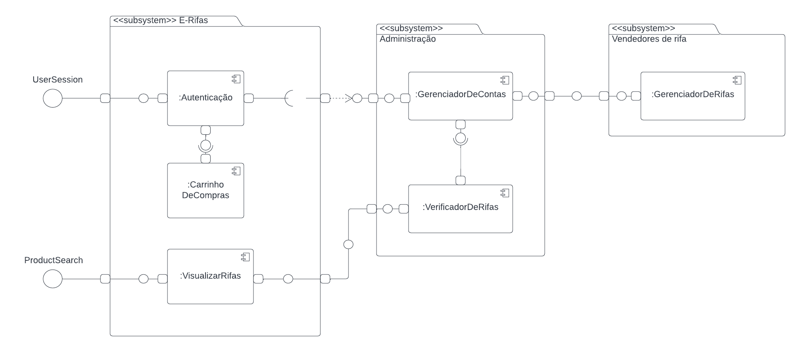

# Diagrama de Componentes

## Histórico de Versões

| Data   | Versão | Descrição                                  | Autor(es)    | Revisor(es) |
| ------ | ------ | ------------------------------------------ | ------------ | ----------- |
| 04-Dez | 0.1    | Criação do documento                       | Eurico Abreu | -           |
| 04-Dez | 0.2    | Construção da Página                       | Eurico Abreu | -           |
| 05-Dez | 0.3    | Mudança da posição do histórico de versões | Eurico Abreu | -           |

## 1. Introdução

Um diagrama de componentes representa a relação estrutural dos componentes de um software. O seu principal uso é quando se trabalha com sistemas complexos com muitos componentes. Os componentes se comunicam uns com os outros usando interfaces. As interfaces são ligadas através de conectores.

## 2. Diagrama de Componentes

|                         |
| :------------------------------------------------------------- |
| Figura 1: Diagrama de componentes.   Autoria: Eurico Abreu |

## Referências

- https://creately.com/blog/pt/diagrama/guia-de-tipos-de-diagramas-uml-aprenda-sobre-todos-os-tipos-de-diagramas-uml-com-exemplos/
