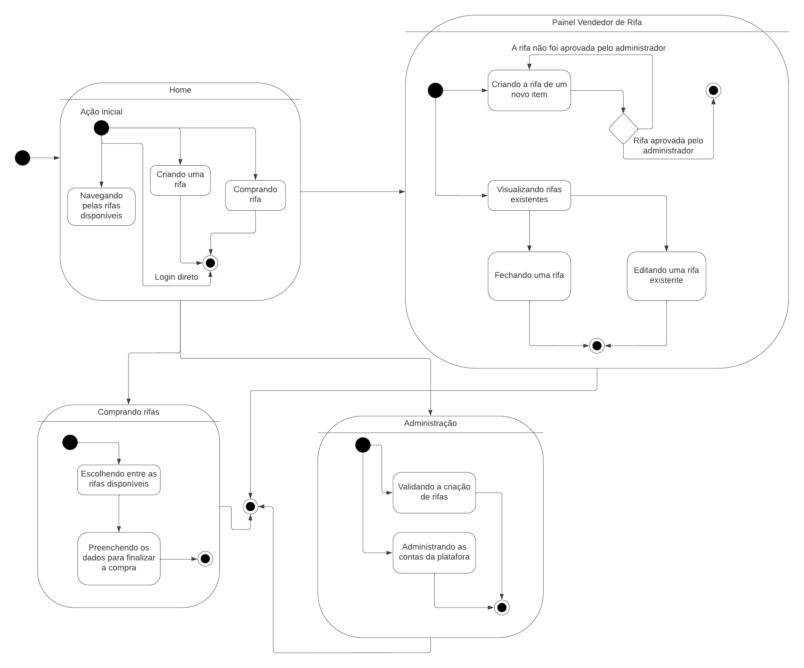

# Diagrama de Estados

| Data   | Versão | Descrição                                  | Autor(es)    | Revisor(es) |
| ------ | ------ | ------------------------------------------ | ------------ | ----------- |
| 04-Dez | 0.1    | Criação do documento                       | Eurico Abreu | -           |
| 04-Dez | 0.2    | Construção da Página                       | Eurico Abreu | -           |
| 05-Dez | 0.3    | Mudança da posição do histórico de versões | Eurico Abreu | -           |

## 1. Introdução

A sua principal utilidade é descrever o comportamento de objetos que agem de forma diferente de acordo com o estado em que se encontram no momento. Também conhecidos como diagramas de estados ou diagramas de gráfico de estados.

## 2. Diagrama de Estados

|                         |
| :--------------------------------------------------------- |
| Figura 1: Diagrama de estados.   Autoria: Eurico Abreu |

## Referências

- https://creately.com/blog/pt/diagrama/guia-de-tipos-de-diagramas-uml-aprenda-sobre-todos-os-tipos-de-diagramas-uml-com-exemplos/
