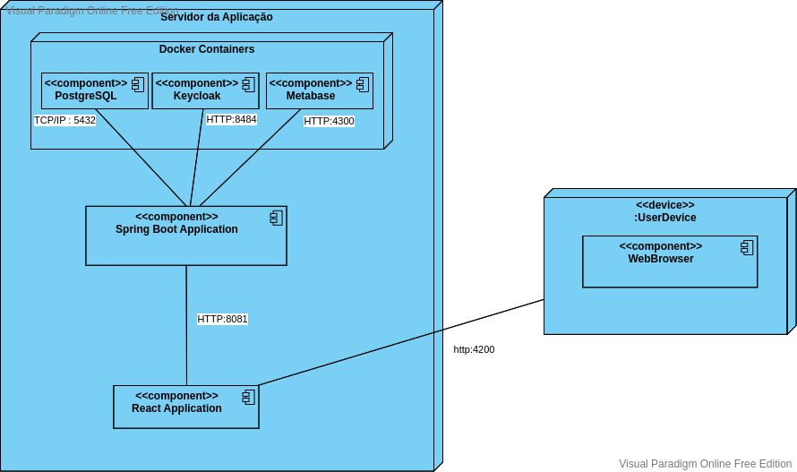

# Diagrama de Implantação

## Histórico de Versões

| Data   | Versão          | Descrição                                                                          | Autor(es)       |
|--------|-----------------|------------------------------------------------------------------------------------|-----------------|
| 02-Dez | 0.1             | Construção do Diagrama utilizando a ferramenta Visual Paradigm Online Free Edition | Guilherme Brito |
| 05-Dez | 0.2 (Documento) | Ajuste de Página para Formatação descrita na página de CONTRIBUTING                | Guilherme Brito |
| 05-Dez | 0.1             | Construção da Página e Documentação do Diagrama Construído                         | Guilherme Brito |

### Participantes do Artefato

- Guilherme Brito (Autor)

## 1. Introdução

Este documento tem por finalidade apresentar um dos diagramas estáticos referentes ao escopo do projeto, sendo ele: o
Diagrama de Implantação. Um diagrama de implantação é um tipo de Diagrama UML que mostra a execução de arquitetura de um
sistema, incluindo nós, como ambientes de execução de hardware ou software, e o middleware que os conecta. [1]

## 2. Metodologia

A Linguagem de Modelagem Unificada (UML) for criada para estabelecer uma linguagem de modelagem visual comum,
semanticamente e sintaticamente rica, para arquitetura, design e implementação de sistemas de software complexos, tanto
estruturalmente quanto para comportamentos.

O Diagrama de Implantação são normalmente usados para visualizar o hardware e software físico de um sistema. Usando-o, é
possível entender como o sistema será fisicamente implantado no hardware.

## 3. Aplicação

Neste trabalho, foi construído um diagrama de Implantação para representar como será a comunicação da aplicação.

### 3.1 - Diagrama de Implantação

No diagrama a seguir é apresentada uma visão de como o Ambiente da Aplicação será servido.

|                               |
|:------------------------------------------------------------------|
| Figura 1: Diagrama de Implantação.   Autoria: Guilherme Brito |

# Referências

- [1] - **O Guia Fácil de Diagramas de Implantação UML** Disponível
  em: https://creately.com/blog/pt/diagrama/tutorial-do-diagrama-de-implantacao/#:~:text=Um%20diagrama%20de%20implanta%C3%A7%C3%A3o%20%C3%A9,software%20f%C3%ADsico%20de%20um%20sistema.

