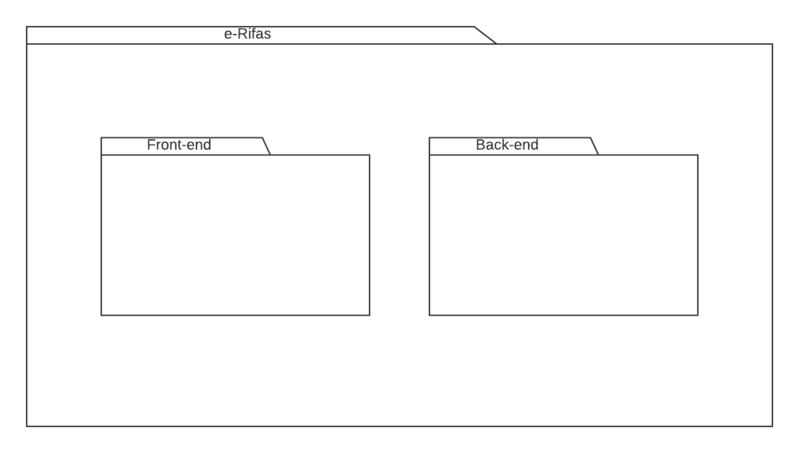
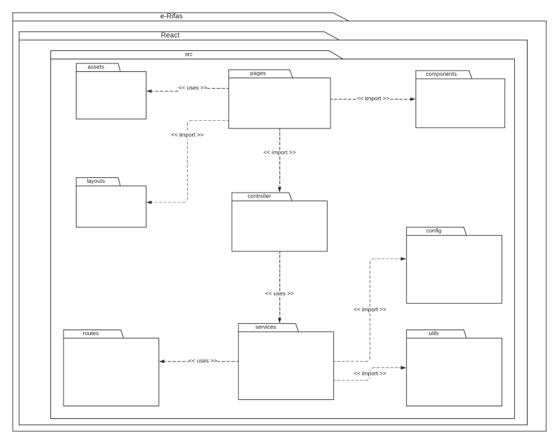

# Diagrama de Pacotes

## Histórico de Versões

| Data   | Versão | Descrição            | Autor(es)      |
| ------ | ------ | -------------------- | -------------- |
| 03-Dez | 0.1    | Construção da Página | Lucas Pimentel |

### Participantes do artefato

- Lucas Pimentel
- João Paulo

## 1. Introdução

Pacote é o termo utilizado para agrupar elementos que possuem relações lógicas e semânticas, sua principal função é organizar os elementos e promover uma melhor estrutura para o modelo do sistema.

Sendo assim, o diagrama de pacotes é um diagrama UML estrutural e estático. Este diagrama mostra a organização e disposição de um determinado sistema à nivel de pacotes, dessa forma, trazendo benefícios como:

- Visão clara de elementos hierárquicos dentro de um sistema
- Criação de elementos visuais organizados
- Boa visibilidade geral de projetos

Além disso, o diagrama de pacotes estabelece laços de dependência entre os vários pacotes representados, assim, mostrando a relação entre um elemento e o outro.

## 2. Metodologia

A partir disso, para a elaboração do diagrama de pacotes do projeto, optamos por dividi-lo em 3 partes, um diagrama específico para o front-end da aplicação, onde utilizaremos o framework ReactJs, outro diagrama específico para o back-end da aplicação, onde optamos por utilizar Java e o framework Spring Boot e por fim um diagrama geral do sistema.

## 3. Diagrama de Pacotes

### 3.1 - Geral

Figura 1: Diagrama de Pacotes Geral e-Rifas -> Fonte: Elaboração própria

### 3.2 - Back-end

Figura 2: Diagrama de Pacotes Back-end e-Rifas -> Fonte: Elaboração própria

### 3.3 - Front-end

Figura 3: Diagrama de Pacotes Front-end e-Rifas -> Fonte: Elaboração própria

## Referências

- UML Package Diagrams Overview - https://www.uml-diagrams.org/package-diagrams-overview.html
- Por que usar um diagrama UML? - LucidChart - https://www.lucidchart.com/pages/pt/diagrama-de-pacotes-uml
