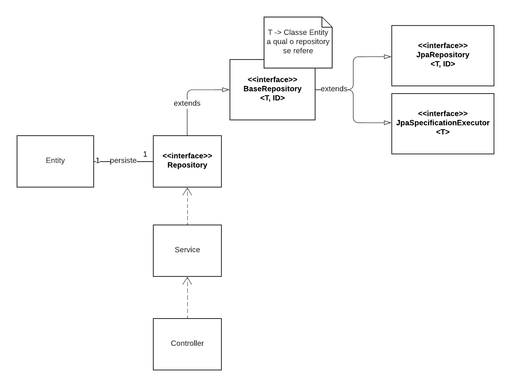

# Diagrama de Classes

## Histórico de Versões

| Data   | Versão          | Descrição                                                           | Autor(es)       |
|--------|-----------------|---------------------------------------------------------------------|-----------------|
| 02-Dez | 0.1 (Diagrama)  | Construção do Diagrama Macro                                        | Guilherme Brito |
| 02-Dez | 0.1 (Diagrama)  | Construção do Diagrama de Entidades                                 | Guilherme Brito |
| 03-Dez | 0.1 (Documento) | Construção da Página                                                | Guilherme Brito |
| 05-Dez | 0.2 (Documento) | Ajuste de Página para Formatação descrita na página de CONTRIBUTING | Guilherme Brito |
| 05-Dez | 0.2 (Documento) | Revisão e correção de link                                          | Andr |

### Participantes do Artefato

- Guilherme Brito (Autor)

## 1. Introdução

Este documento tem por finalidade apresentar um dos diagramas estáticos referentes ao escopo do projeto, sendo ele: o
Diagrama de Classes. Diagramas de classes estão entre os tipos mais úteis de diagramas UML pois mapeiam de forma clara a
estrutura de um determinado sistema ao modelar suas classes, seus atributos, operações e relações entre objetos. [1]

## 2. Metodologia

A Linguagem de Modelagem Unificada (UML) for criada para estabelecer uma linguagem de modelagem visual comum,
semanticamente e sintaticamente rica, para arquitetura, design e implementação de sistemas de software complexos, tanto
estruturalmente quanto para comportamentos.

O Diagrama de Classes é um diagrama UML Estrutural mais usado e a principal base de qualquer solução orientada a
objetos. Nele, são representadas as classes dentro de um sistema, atributos e operações, e a relação entre elas.

## 3. Aplicação

Neste trabalho, foi construído dois diagramas de classes, sendo eles:

1. Diagrama de Classes que exemplifica a relação das classes em um projeto Spring Boot (Framework Utilizado para o
   Backend da aplicação)
2. Diagrama de Classes referente as Entities (Entidades) da Aplicação

### 3.1 - Diagrama ecossistema Spring Boot

No diagrama a seguir é apresentado uma visão macro de um projeto Spring Boot.

|                                                                               |
|:-------------------------------------------------------------------------------------------------------------|
| Figura 1: Diagrama Visão Macro de Classes que compõem um projeto Spring Boot.   Autoria: Guilherme Brito |

Nele, são representados as classes principais que compõem um projeto Spring Boot.

1. Entity -> Classes que espelham as tabelas que serão persistidas no Banco de Dados.
2. Repository -> Interfaces que extendem outras interfaces que fornecem métodos pertinentes ao contexto de
   Persistência. (Cada Entity terá a sua Repository)
3. Service -> Classes que se comunicam com as _repositories_ e onde estão presentes a maioria das regras de negócio do
   sistema.
4. Controller -> Classes que recebem as requisições REST.

IMPORTANTE salientar que cada entity possui sua Repository, Service e Controller.

### 3.2 - Diagrama de Classes (Entities)

No contexto das _entities_, elas são classes que modelam o Banco de Dados e portanto possuem seus atributos e seus
relacionamentos. O diagrama abaixo mostra como o sistema é visualizado no contexto das Entidades.

|                                                              |
|:-----------------------------------------------------------------------------------------------|
| Figura 2: Diagrama de Classes que compõem as entities do Projeto. Autoria: Guilherme Brito |

As classes referentes a Autorização e Autenticação são abstraídas
no [Keycloak](https://www.keycloak.org/) (Por exemplo, a tabela user_entity no diagrama abaixo descreve a classe
Usuário). O Diagrama de
Esquemas desse serviço pode ser visto abaixo ou neste [link](http://encurtador.com.br/gpsJK).

|  |
|:---------------------------------------------------------------------------------------------------------------------------------------------------------------------------------|
| Figura 3: Diagrama de Esquemas do Serviço de Autenticação e Autorização utilizado no Projeto.                                                                                    |

## Referências

- [1] - **O que é um diagrama de classes?** Disponível
  em: https://www.lucidchart.com/pages/pt/o-que-e-diagrama-de-classe-uml
- Video Aula apresentado pela Professora Milene Serrano disponível no Aprender3
- **O que é UML?** Disponível em: https://blog.betrybe.com/tecnologia/uml/

