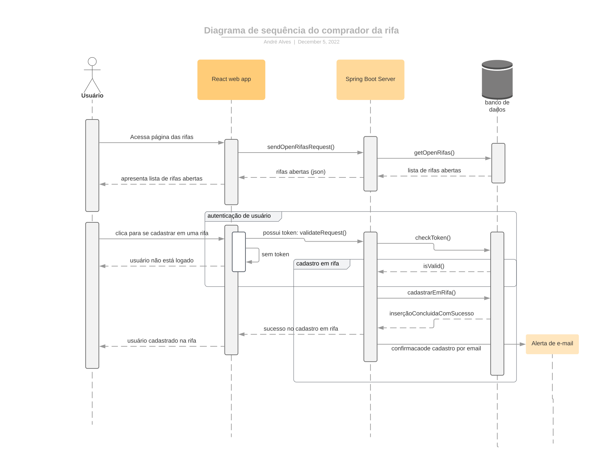
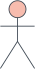
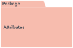
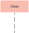

# Diagrama de Sequência

## Histórico de Versões

| Data   | Versão          | Descrição                                          | Autor(es)   | Revisor(es)  |
| ------ | --------------- | -------------------------------------------------- | ----------- | ------------ |
| 02-Dez | 0.1 (Diagrama)  | Estudo sobre a criação de um diagrama de sequência | André Alves | Eurico Abreu |
| 04-Dez | 0.1 (Diagrama)  | Construção do Diagrama de Sequência                | André Alves | Eurico Abreu |
| 05-Dez | 0.1 (Documento) | Construção da Página                               | André Alves | Eurico Abreu |
| 05-Dez | 0.2 (Documento) | Adicionando tabela de símbolos                     | André Alves | Eurico Abreu |

### Participantes do Artefato

- André Alves (Autor)

## 1. Introdução

Este documento tem por finalidade apresentar um dos diagramas dinâmicos referentes ao escopo do projeto, sendo ele: o
Diagrama de Sequência. O Diagrama de Sequência é solução dinâmica de modelagem em UML bastante usada porque incide especificamente
sobre linhas da vida, ou os processos e objetos que vivem simultaneamente, e as mensagens trocadas entre eles para desempenhar uma
função antes do término da linha da vida [1].

## 2. Metodologia

O Diagrama de Sequências, é um diagrama tipo de diagrama UML que representa a interação do usuário com o sistema de forma dinâmica,
pois descreve como e em qual ordem um grupo de objetos trabalha em conjunto. Ele é ideal para auxiliar o desenvolvedor a compreender
a lógica de cada cenário de uso do seu sistema e como esses cenários interagem com o usuário.

Alguns dos benefícios de um diagrama de sequência são:

1. Representar os detalhes de um caso de uso UML.
2. Modelar a lógica de um processo, função ou operação sofisticado.
3. Ver como objetos e componentes interagem uns com os outros para concluir um processo.
4. Planejar e compreender a funcionalidade detalhada de um cenário existente ou futuro.

## 3. Aplicação

Neste trabalho, foi construído um diagrama de sequência, sendo eles:

1. O Diagrama representando a interação do usuário com o sistema durante o cadastro em uma rifa.

### 3.1 - Diagrama Sequência do Comprador de uma rifa

|  |
| :---------------------------------------------------------------------- |
| Figura 1: Diagrama de Sequência do comprador. Autoria: André Alves  |

### 4 - Tabela de símbolos

| Símbolo                                                                          | Nome                     | Descrição                                                                                                                                                                                                                                                                  |
| :------------------------------------------------------------------------------- | ------------------------ | -------------------------------------------------------------------------------------------------------------------------------------------------------------------------------------------------------------------------------------------------------------------------- |
|         | Símbolos de Objetos      | Representa uma classe ou objetos em UML. O símbolo do objeto demonstra como um objeto se comportará no contexto do sistema. Atributos de classe não devem ser listados nesta forma.                                                                                        |
|   | Caixa de ativação        | Representa o tempo necessário para que um objeto conclua uma tarefa. Quanto mais tempo a tarefa levar, mais alongada a caixa de ativação se torna.                                                                                                                         |
|              | Símbolo de ator          | Mostra as entidades que interagem com, ou são externas ao sistema.                                                                                                                                                                                                         |
|          | Símbolo de pacote        | Representa a passagem do tempo, conforme estende-se para baixo. Esta linha vertical tracejada mostra os eventos sequenciais que ocorrem a um objeto durante o processo no gráfico. Linhas da vida podem começar com uma forma de retângulo rotulado ou um símbolo de ator. |
|  | Símbolo de linha de vida | Representa a passagem do tempo, conforme estende-se para baixo. Esta linha vertical tracejada mostra os eventos sequenciais que ocorrem a um objeto durante o processo no gráfico. Linhas da vida podem começar com uma forma de retângulo rotulado ou um símbolo de ator. |

## Referências

- [1] - **O que é um diagrama de sequência UML?** Disponível
  em: https://www.lucidchart.com/pages/pt/o-que-e-diagrama-de-sequencia-uml
- Video Aula apresentado pela Professora Milene Serrano disponível no Aprender3
