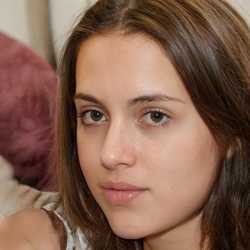
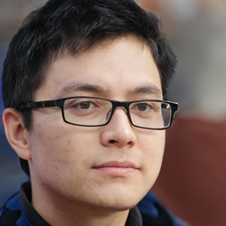

# Personas

## 1. Introdução

De acordo com Simone Barbosa (2015), personas são personagens ficcionais, formulados a partir da síntese dos comportamentos observados entre os consumidores alvos do produto. Elas representam as expectativas e necessidades, reunindo as principais características de cada grupo.

Esta técnica é muito utilizada durante discussões de design e elicitação de requisitos, para que o time se mantenha focado em um mesmo alvo em relação aos usuários. Dessa forma, fazendo com que a equipe não busque satisfazer a maior parte das pessoas, e sim seus grupos de usuários reais.

As personas tem como objetivo descrever um usuário típico do sistema. Estes personagens, embora sejam fictícios, são derivados de processos de investigação e pesquisa que buscam levantar dados e características sobre os usuários, no caso deste projeto tais investigações e seus resultados podem ser encontrados na secção de Perfil de Usuário

## 2. Metodologia

Com o objetivo de especificar nossos grupos de usuários em personas, primeiro tivemos que decidir a quantidade de personas que seriam definidas. Dessa forma, com base no livro "Interação Humano Computador" de Simone Barbosa (2015), foi decidido que seriam definidas 3 personas primárias e 1 antipersona.

Além disso, a criação de nossas personas foram baseadas nos elementos característicos especificados por Courage e Baxter(2005), que são:

- Identidade: nome, sobrenome, idade e outros dados demográficos.
  Status: define se é persona primária, secundária, ou então, outro stakeholder ou antipersona.

- Objetivos: descreve objetivos das personas.

- Habilidades: especialidade, grau de escolaridade, grau de familiaridade com tecnologia.

- Tarefas: descreve as tarefas realizadas pela persona no sistema.

- Requisitos: de que a persona precisa.

## 3. Perfil de Usuário

Com o objetivo de aumentar o conhecimento sobre os usuários do sistema, uma técnica muito utilizada é o registro do Perfil do Usuário. Sendo assim, este perfil nos ajuda compreender um pouco mais sobre as características destes usuários, respondendo perguntas como quem são, quais seus objetivos, e também, coletando dados demográficos deles. Desta forma, o perfil de usuário irá compor uma descrição detalhada das características dos usuários que irão utilizar o sistema.

Para a elaboração do Perfil de Usuário optamos pelo uso de questionários online, utilizando a plataforma do [Google Forms](https://workspace.google.com/intl/pt-BR/products/forms/), para que dessa forma possamos coletar dados de um maior número de usuários. As perguntas feitas e respostas obtidas por este questionário podem ser encontradas na página de [Questionários]() na aba de técnicas de elicitação. Sendo assim, chegamos as seguintes conclusões:

- A grande maioria de nossos usuários estão na faixa etária entre 18 e 28 anos.
- Cerca de 32% dos usuários que responderam possuem renda mensal familiar entre 10 e 20 salários mínimos.
- 72% do grupo de resposta já adquiriu uma rifa.
- Mais de 75% dos usuários utiliza o instagram e whatsapp para comprar ou vender rifas, ou seja, possuem experiência com tecnologias e redes sociais.

## 4. Personas

Partindo das características coletadas pelo Perfil de Usuário, as personas criadas pela equipe foram:

### 4.1 Persona 1

Persona 1: Manuela Campos -> Fonte: [thispersondoesnotexist.com](https://thispersondoesnotexist.com/)

- Idade: 20 anos.
- Escolaridade: Ensino médio completo.
- Profissão: Influenciadora digital.
- Status: Primária.
- Habilidade: Se sente muito confortável utilizando novas tecnologias.
- Objetivo: Deseja acessar uma plataforma simplificada para fazer rifas para seus seguidores e aumentar o engajamento em suas redes sociais.
- Tarefas: Abrir e fechar rifas

Manuela é uma jovem de 20 anos que, ainda no ensino médio, decidiu seguir seu sonho e se tornou uma influenciadora digital. Para isso, optou por não entrar na faculdade e se concentrar em aumentar seus seguidores nas redes sociais. Dessa forma, uma das maneiras que ela encontrou para chamar a atenção das pessoas é fazendo rifas online. Porém, Manuela acha muito complicado realizar essas rifas pelo Instagram ou outras redes sociais e gostaria de acessar uma plataforma especializada para fazer seus sorteios.

## 4.2 Persona 2

Persona 2: Daniel Ribeiro -> Fonte: [thispersondoesnotexist.com](https://thispersondoesnotexist.com/)

- Idade: 25 anos.
- Escolaridade: Ensino superior completo.
- Profissão: Designer.
- Status: Primária.
- Habilidade: Se sente muito confortável utilizando novas tecnologias.
- Objetivo: Deseja acessar uma plataforma em que possa buscar rifas para participar.
- Tarefas: Buscar, filtrar e comprar rifas.

Daniel tem 25 anos, se formou em comunicação social e atualmente trabalha como designer de uma empresa. Recentemente, Daniel se mudou da casa dos seus pais e está precisando economizar com as compras para manter sua nova vida morando sozinho. Sendo assim, uma das alternativas que Daniel encontrou foi participar de rifas para tentar obter produtos por valores mais em conta e já teve sorte algumas vezes.

## 4.2 Persona 3

Persona 3: Kleber Moraes -> Fonte: [thispersondoesnotexist.com](https://thispersondoesnotexist.com/)

- Idade: 28 anos.
- Escolaridade: Ensino superior completo.
- Profissão: Empresário.
- Status: Primária.
- Habilidade: Utiliza o computador para trabalho todos os dias.
- Objetivo: Deseja acessar uma plataforma para divulgar e vender rifas.
- Tarefas: Abrir e fechar rifas.

Kleber é um empresário de 28 anos, e recentemente se casou. Com o objetivo juntar dinheiro para sua viagem de lua de mel, Kleber decidiu abrir rifas para vender alguns equipamentos eletrônicos que possuía e não utilizava mais. Porém, por ter um baixo número de seguidores nas redes sociais, não conseguiu que muitas pessoas comprassem suas rifas ao anunciar em seu Instagram e Whatsapp, então decidiu ir atrás de uma plataforma especializada para divulgar estas rifas.

## Referências

- BARBOSA, Simone; SILVA, Bruno. Interação Humano Computador. Rio de Janeiro. Elsevier Editora Ltda. 2010
- COURAGE, Catherine; BAXTER, Kathy. Understanding Your Users: A pratical guide to user requirements methods, tools and techniques. 2005

## Histórico de Versões

| Data   | Versão | Descrição                                          | Autor(es)       | Revisor(es)  |
| ------ | ------ | -------------------------------------------------- | --------------- | ------------ |
| 29-Nov | 0.1    | Construção da Página                               | Lucas Pimentel  | Eurico Abreu |
| 01-Dec | 0.2    | Adiciona perfil de usuário                         | Lucas Pimentel  | Eurico Abreu |
| 01-Dec | 0.3    | Adiciona personas                                  | Lucas Pimentel  | Eurico Abreu |
| 01-Dec | 0.4    | Correções ortográficas e boas práticas em markdown | Eurico Abreu    | -            |
| 02-Dec | 0.5    | Formatação e correção ortográfica do arquivo       | João Paulo Lima | -            |
