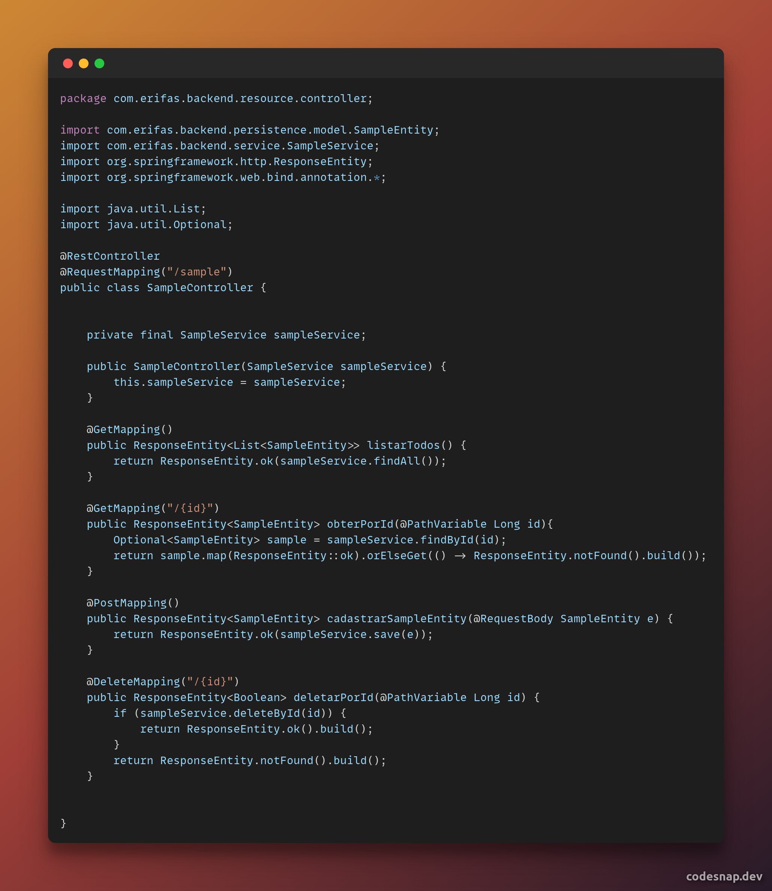

# Injeção de Dependencias

## Histórico de Versões

| Data       | Versão | Descrição          | Autor(es)       |
| ---------- | ------ | ------------------ | --------------- |
| 05/01/2023 | 0.1    | Criação do Arquivo | João Paulo Lima |

### Participantes do artefato

- João Paulo Lima (Autor)

## 1. Introdução

A injeção de dependência é uma técnica de programação que permite que os objetos de um sistema tenham suas dependências fornecidas externamente, ao invés de criá-las internamente. Isso pode ajudar a tornar o código mais modular e fácil de manter, pois permite que as dependências sejam substituídas facilmente.

## 2. Aplicação no Projeto

No Spring Boot que é uma plataforma baseada no Spring que fornece uma maneira fácil de criar aplicativos Java de alto desempenho com pouco ou nenhum código de configuração. O @RestMapping é uma anotação do Spring que pode ser usada para mapear métodos de um controlador REST para solicitações HTTP específicas. Por exemplo, um método anotado com @GetMapping será mapeado para solicitações GET, enquanto um método anotado com @PostMapping será mapeado para solicitações POST.

## 4. Conclusão

Os padrões de projeto emergentes, por outro lado, são aqueles que surgem de forma natural durante o desenvolvimento de um sistema, em oposição aos padrões preconcebidos que são planejados no início do projeto. Eles são um resultado da solução de problemas durante o desenvolvimento do sistema e tendem a ser específicos daquele sistema.

## Referências

- Injeção de Dependencias Spring - https://blog.algaworks.com/injecao-de-dependencias-spring/#:~:text=Inje%C3%A7%C3%A3o%20de%20Depend%C3%AAncia%20%C3%A9%20um,facilita%20a%20manuten%C3%A7%C3%A3o%20do%20c%C3%B3digo.
- Autowired e a injeção de dependência do Spring - https://medium.com/@leonardogiuliani/autowired-e-a-inje%C3%A7%C3%A3o-de-depend%C3%AAncia-do-spring-d8864cc9af50
