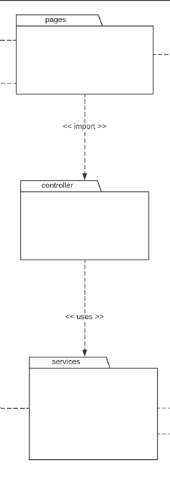

# Controller

## Histórico de Versões

| Data   | Versão | Descrição            | Autor(es)      |
| ------ | ------ | -------------------- | -------------- |
| 04-Jan | 0.1    | Construção da Página | Lucas Pimentel |
| 04-Jan | 0.2    | Adiciona introdução  | Lucas Pimentel |

## 1. Introdução

Um dos principais componentes do padrão GRASP é o controlador. O controlador tem o propósito de delegar eventos e regras de negócio para uma classe não-visual, orquestrando as operações do sistema, gerenciando a interação com os usuários e fazendo a ligação entre as diferentes partes do sistema. O controlador também pode ser responsável por tratar exceções e garantir a integridade dos dados.

O uso de um controlador pode ajudar a garantir que o sistema seja escalável e mantenível, pois permite que as responsabilidades sejam divididas de maneira clara entre as diferentes partes do sistema. Além disso, o uso de um controlador pode ajudar a garantir a coesão do sistema, quando não atribuido de muitas responsabilidades, pois ele centraliza a lógica de negócios em um único ponto.

No entanto, é importante notar que o uso de um controlador também pode levar a sistemas mais complexos, pois ele adiciona uma camada de abstração adicional. É importante avaliar cuidadosamente se o uso de um controlador é adequado para um determinado sistema e, se for o caso, garantir que ele seja implementado de maneira eficiente.

## 2. Aplicação no projeto

Figura 1 -> Fonte: Diagrama de pacotes do projeto

Figura 2 -> Fonte: Diagrama de pacotes do projeto

## Referências

- BEZERRA, Eduardo; SANTOS, Ismael. Modulo I Padrões GRASP. PUC-RIO - https://web.tecgraf.puc-rio.br/~ismael/Cursos/Cidade_FPSW/aulas/Modulo1_Intro_Grasp_GoF/Grasp/PadroesGRASP.pdf

- SERRANO, Milene. GRASPS - Material Complementar parte 1 - https://aprender3.unb.br/pluginfile.php/2277128/mod_label/intro/Arquitetura%20e%20Desenho%20de%20Software%20-%20Aula%20GRASP_A%20-%20Profa.%20Milene%20-%20Complementar.pdf

- CELESTINO, André. Design Patterns GRASP – Controller - https://www.andrecelestino.com/delphi-design-patterns-grasp-controller/
