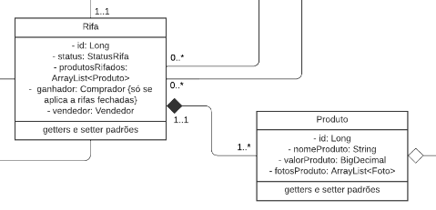

# GRASP Foco: Especialista

## Histórico de Versões

| Data   | Versão | Descrição            | Autor(es)    | Revisor(es) |
| ------ | ------ | -------------------- | ------------ | ----------- |
| 05-Jan | 0.1    | Criação do documento | Eurico Abreu | -           |
| 05-Jan | 0.2    | Introdução           | Eurico Abreu | -           |

## 1. Introdução

O padrão GRASP especialista tem a sua preocupação principal em atribuir responsabilidades para a entidade mais especialista em um dado aspecto, não apenas na criação de instâncias, mas em todos os aspectos do sistema. Tem bastante semelhança com o GRASP Criador, já que todo criador é um especialista em criar instâncias.

## 2. Aplicação no projeto

Em nosso projeto, encontramos um exemplo de GRASP especialista no diagrama de classes de entidades.

Figura 1 -> Fonte: Diagrama de classes

## 3. Conclusão

## Referências

- [1] SERRANO, Milene. Arquitetura e Desenho de Software. AULA - GRASP – PARTE I e II. Acesso em: 04 jan. 2023.
- [2] SERRANO, Milene. Arquitetura e Desenho de Software. AULA - GRASP – COMPLEMENTAR A e B. Acesso em: 04 jan. 2023.
- [3] Basseto, Nelson. RDD – Responsibility Driven Design e GRASP – General Responsibility Assignment Software Principles. Disponivel em: http://nelsonbassetto.com/blog/tags/grasp/ Acesso em: 04 jan. 2023.
