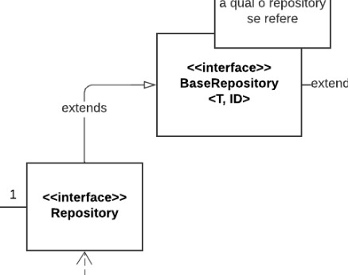

# Polimorfismo

## Histórico de Versões

| Data   | Versão | Descrição            | Autor(es)    | Revisor(es) |
| ------ | ------ | -------------------- | ------------ | ----------- |
| 04-Jan | 0.1    | Criação do documento | Eurico Abreu | -           |
| 04-Jan | 0.2    | Adição do conteúdo   | Eurico Abreu | -           |

## 1. Introdução

O polimorfismo é um padrão da orientação à objetos, no qual classes derivadas de uma única classe principal são capazes de chamar outros métodos que podem ter comportamentos diferentes para cada uma das classes derivadas. O polimorfismo traz muitas vantagens para um projeto, por exemplo:

- Facilita estender o projeto com novas funcionalidades
- Praticidade em projetos com variações semelhantes
- Adição de novas funcionalidades sem afetar os clientes

## 2. Aplicação no projeto

Em nosso projeto, podemos localizar um exemplo de polimorfismo na imagem abaixo, retirada do diagrama de classes do projeto. Nesse caso, temos uma classe que oferece uma repository padrão, com alguns metódos e queries, porém é possível adicionar mais queries se necessário.

Figura 1 -> Fonte: Diagrama de pacotes do projeto

## 3. Conclusão

Por fim, conclui-se que, a utilização de polimorfismo no projeto é praticamente indispensável, facilitando muito o processo de expansão do mesmo. Isso permite que novas funcionalidades sejam adicionadas de maneira muito mais simples, tornando a evolução do software mais prática e rápida.

## Referências

- [1] SERRANO, Milene. Arquitetura e Desenho de Software. AULA - GRASP – PARTE I e II. Acesso em: 04 jan. 2023.
- [2] SERRANO, Milene. Arquitetura e Desenho de Software. AULA - GRASP – COMPLEMENTAR A e B. Acesso em: 04 jan. 2023.
- [3] Basseto, Nelson. RDD – Responsibility Driven Design e GRASP – General Responsibility Assignment Software Principles. Disponivel em: http://nelsonbassetto.com/blog/tags/grasp/ Acesso em: 04 jan. 2023.
