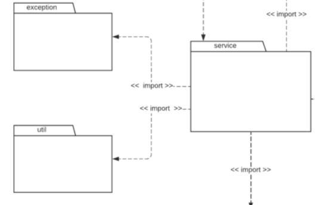

# Invenção Pura

## Histórico de Versões

| Data   | Versão | Descrição                       | Autor(es)      |
| ------ | ------ | ------------------------------- | -------------- |
| 05-Jan | 0.1    | Construção da Página            | Lucas Pimentel |
| 05-Jan | 0.2    | Adiciona introdução e aplicação | Lucas Pimentel |
| 05-Jan | 0.3    | Adiciona conclusão              | Lucas Pimentel |

## 1. Introdução

Dentro os padrões GRASPs, existe o padrão da invenção pura, que se refere à atribuição de responsabilidades altamente coesas a classes que são criadas exclusivamente para cumprir essas responsabilidades.

A invenção pura pode ser útil em situações em que uma responsabilidade é muito específica e não tem nenhuma relação com as responsabilidades de outras classes no sistema. Alocar essa responsabilidade a uma classe criada exclusivamente para cumpri-la pode ajudar a garantir a coesão do sistema, evitar que outras classes fiquem sobrecarregadas com responsabilidades adicionais e aumenta a capacidade de reutilização do software.

## 2. Aplicação no projeto

Podemos encontrar exemplos do padrão de invenção pura no ecossistema do Spring Boot (Framework que será utilizado para desenvolvimento do backend do projeto). Sendo assim, dentro das classes que compõem um projeto Spring Boot temos os classes do pacote útil, que reunem métodos que serão utilizados durante todo o projeto em diversas outras classes, estes métodos podem ser desde transformações de tipos de dados (string para int, int para double, etc.) até métodos mais relacionados com as regras de negócio da aplicação. Podemos ver este pacote e suas relações a partir da imagem abaixo:

Figura 1 -> Fonte: Diagrama de pacotes do projeto

## 3. Conclusão

Por fim, são claras as vatagens da utilização do padrão de invenção pura durante o projeto, pois desta forma poderemos aumentar a coesão, diminuir o acoplamento e aumentar a reutilização do código. Porém, devemos tomar cuidado ao agrupar as reponsabilidades e criar classes, para que os comportamentos não se dispersem por um grande número de classes criados.

## Referências

- RUBETS, Serhii. GRASP Principles - Part 3- https://hackernoon.com/grasp-principles-part-3-polymorphism-pure-fabrication-indirection-protected-variations

- SERRANO, Milene. GRASPS - Material Complementar parte 2 - https://aprender3.unb.br/pluginfile.php/2277128/mod_label/intro/Arquitetura%20e%20Desenho%20de%20Software%20-%20Aula%20GRASP_B%20-%20Profa.%20Milene%20-%20Complementar.pdf
