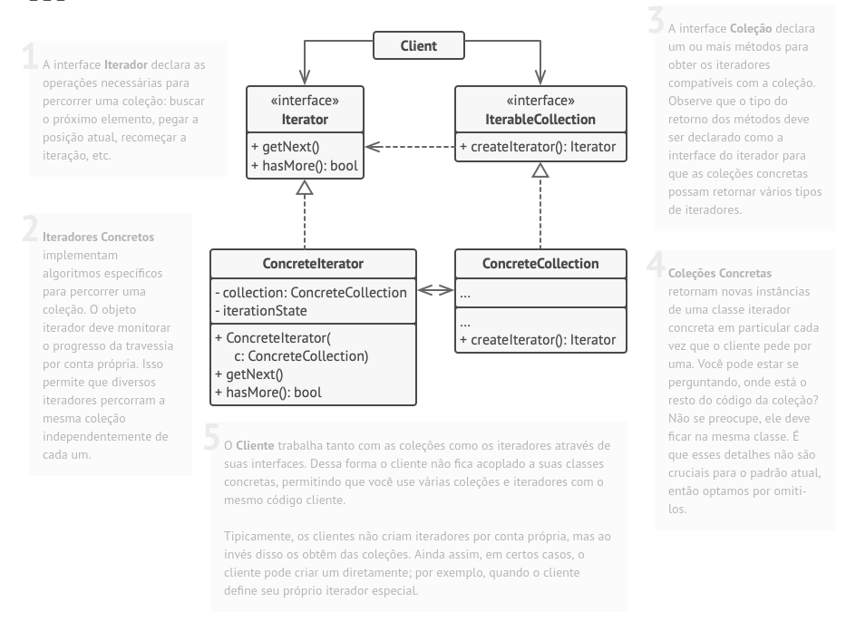
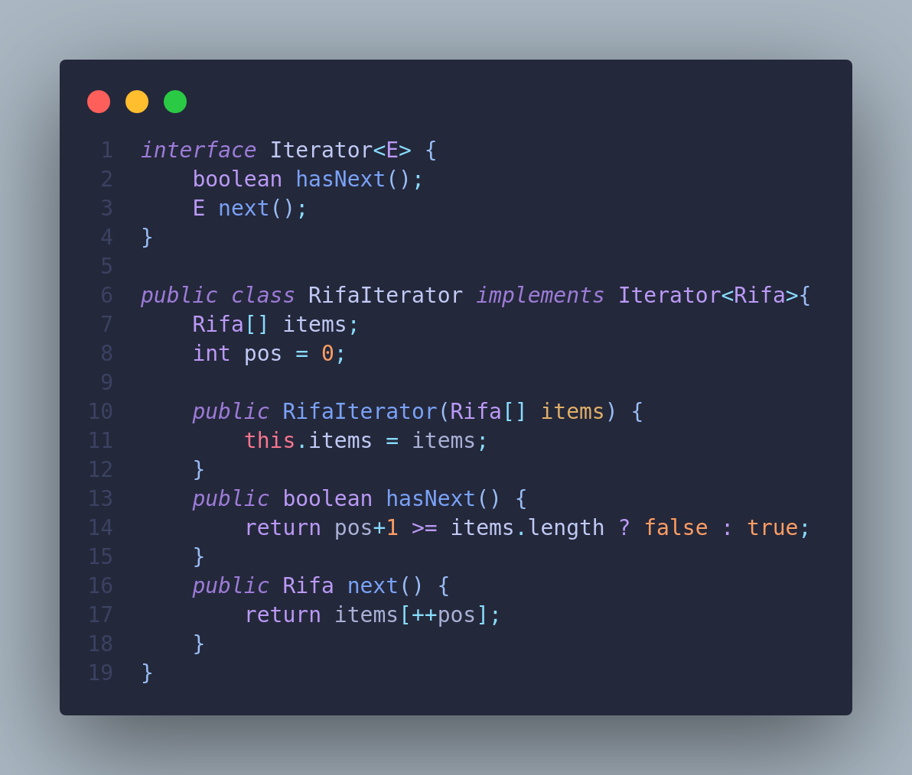

# Diagrama de Pacotes

## Histórico de Versões

| Data       | Versão | Descrição                          | Autor(es)   |
| ---------- | ------ | ---------------------------------- | ----------- |
| 03/01/2023 | ---    | Implementação do Iterator em Java  | André Alves |
| 05/01/2023 | 0.1    | Criação do artefato                | André Alves |
| 05/01/2023 | 0.2    | Adição da Introdução e metodologia | André Alves |
| 05/01/2023 | 1.0    | Adição do código em Java           | André Alves |

### Participantes do artefato

- André Alves (Autor)

## 1. Introdução

O Iterator é um padrão de projeto de software que permite aos usuários percorrer sequencialmente os elementos de uma coleção, sem conhecer a representação subjacente da coleção. Esse padrão resolve o problema de ter que escrever código específico para percorrer diferentes tipos de coleções de elementos.

Sem o padrão Iterator, se você quisesse percorrer elementos em uma lista, teria que escrever código específico para percorrer a lista. Se quisesse percorrer elementos em um conjunto, teria que escrever código específico para percorrer o conjunto. Isso pode ser tedioso e pode levar a código repetido.

Com o padrão Iterator, você pode criar uma interface Iterator que define como percorrer os elementos de uma coleção. Você pode então implementar essa interface para criar iteradores específicos para diferentes tipos de coleções. Isso permite que você percorra elementos em diferentes tipos de coleções de forma uniforme, sem ter que escrever código específico para cada tipo de coleção.

## 2. Modelagem

O padrão Iterator consiste em criar uma interface para criar iteradores que percorrem uma coleção de elementos de forma sequencial. Essa interface geralmente inclui métodos para percorrer a coleção, como next e hasNext.

A classe concreta que implementa a interface Iterator é responsável por manter o estado atual da iteração e por fornecer os elementos da coleção de forma sequencial.

O padrão Iterator é útil quando precisamos percorrer uma coleção de elementos e queremos fazer isso de forma independente da representação da coleção. Isso nos permite percorrer elementos em diferentes tipos de coleções de forma uniforme, sem precisar conhecer a implementação específica de cada coleção.

|                |
| :--------------------------------------------------------------: |
| Figura 1: Estrutura de um Iterator   Fonte: refactoring.guru |

## 3. Implementação

Implementação de um Iterator que percorre Rifas em java:

|                       |
| :----------------------------------------------------------------: |
| Figura 2: Implementação do padrão Iterator em Java por André Alves |

## 5. Conclusão

Em conclusão, o padrão de projeto Iterator é um padrão de projeto de software que permite aos usuários percorrer elementos em uma coleção de forma sequencial, sem conhecer a representação subjacente da coleção. Ele é útil porque permite que os usuários percorram elementos em diferentes tipos de coleções de forma uniforme, sem ter que escrever código específico para cada tipo de coleção. A interface Iterator nativa do Java fornece uma implementação padrão dessa interface, que pode ser usada para percorrer elementos em coleções do Java de forma simples e consistente.

## Referências

- Iterator Pattern - https://refactoring.guru/pt-br/design-patterns/iterator
- Documentação da interface Iterator em Java - https://refactoring.guru/pt-br/design-patterns/iterator
