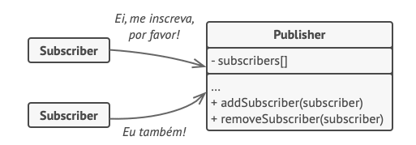
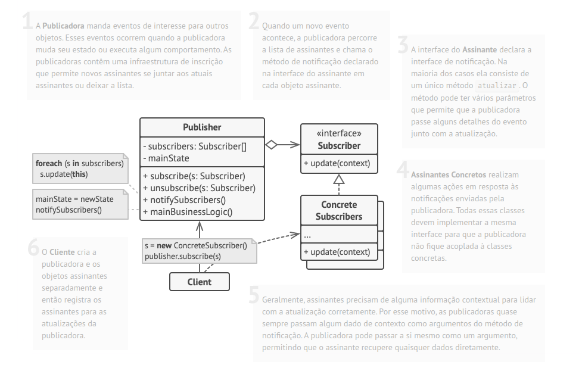
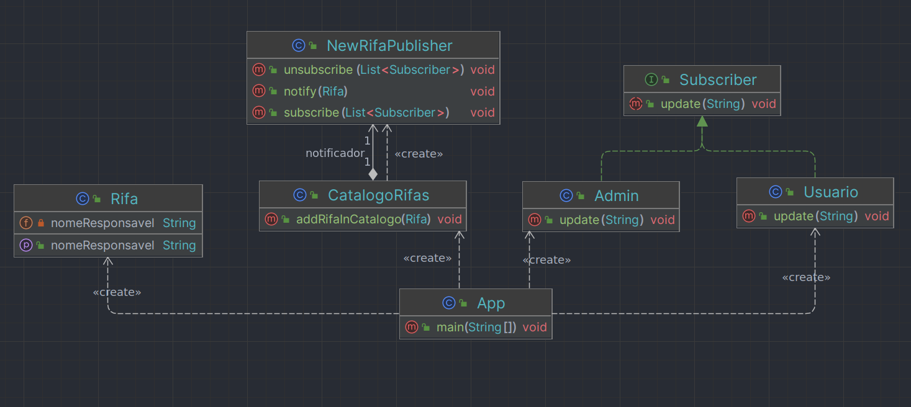
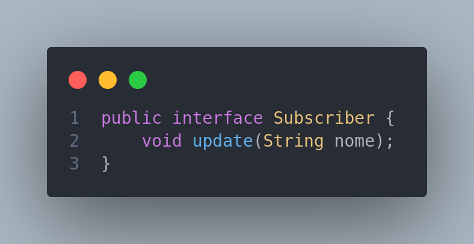
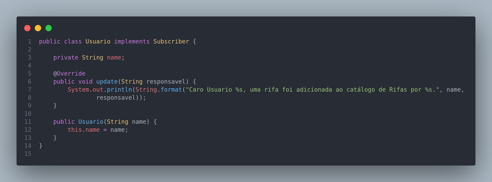
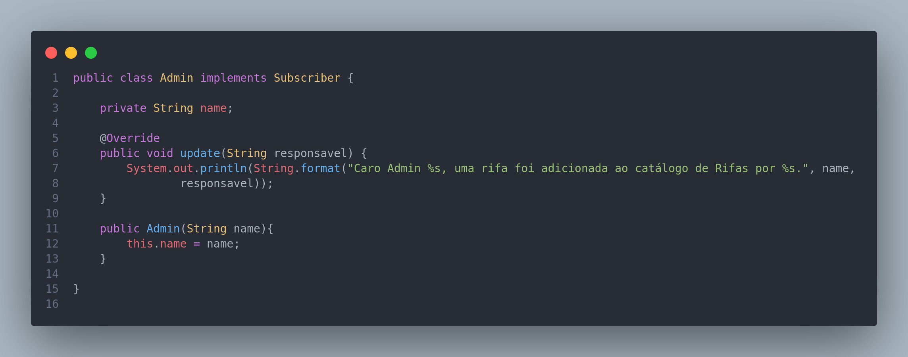
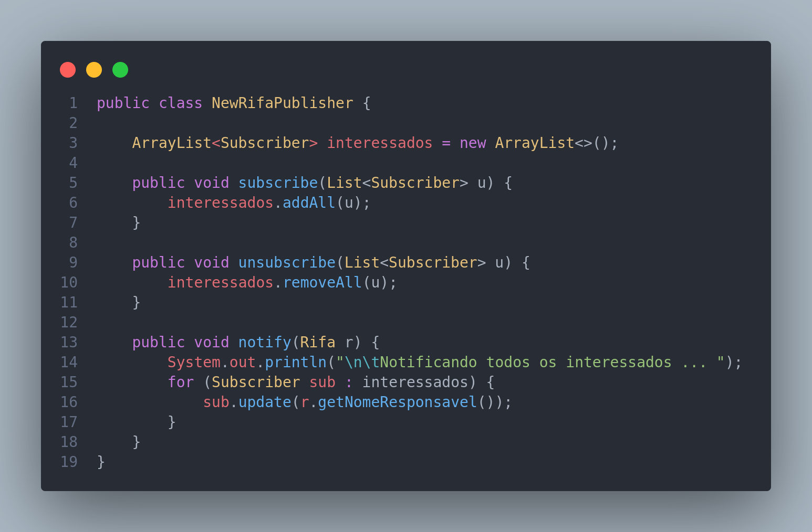
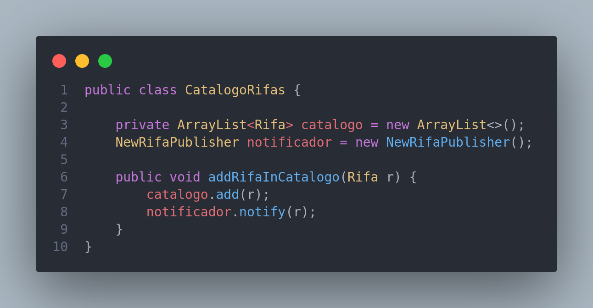
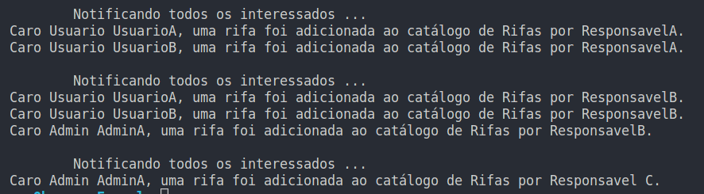

# Diagrama de Pacotes

## Histórico de Versões

| Data       | Versão | Descrição                                                         | Autor(es)       |
| ---------- | ------ | ----------------------------------------------------------------- | --------------- |
| 03/01/2023 | 0.1    | Redação Introdução                                                | Guilherme Brito |
| 04/01/2023 | 0.2    | Redação Modelagem e Estudo de Caso                                | Guilherme Brito |
| 05/01/2023 | 1.0    | Redação Implementação e Finalização do Artefato                   | Guilherme Brito |
| 05/01/2023 | 1.1    | Algumas correções, como caminho de imagens e correções de tabelas | Guilherme Brito |
| 05/01/2023 | 1.1    | Revisão do artefato                                               | André Alves     |

### Participantes do artefato

- Guilherme Brito (Autor)

## 1. Introdução

O Padrão de Projeto **Observer** é um padrão comportamental que permite que um mecanismo de assinatura seja definido
para notificar múltiplos objetos
sobre quaisquer eventos que aconteçam com o objeto que estes estão "observando".

Esse padrão se torna útil para serviços de **notificação** por exemplo.

Em analogia ao mundo real, quando alguém se **inscreve** em um jornal ou revista, ele não precisa ir de tempo em tempo
na banca para ver se uma nova edição foi lançada. Com o serviço de assinatura, é feito a notificação (de 1 ou N formas)
de que
uma nova edição está disponível.

## 2. Modelagem

Para a implementação desse padrão, foi pensado no seguinte cenário:

- Notificação de Novas Rifas para Usuários que optaram por receber essas notificações.

Em todo problema o qual se aplica o Padrão de Projeto Observer, dois atores importantes são mencionados:

> - Subscriber (Assinante): Parte Observadora
> - Publicador (Publisher): Parte Notificadora de Algum Evento

O padrão também sugere um mecanismo de assinatura para a classe publicadora para que objetos individuais possam assinar
ou desassinar a corrente de eventos. Esse mecanismo consiste em:

1. Um vetor para armazenar uma lista de referências de Objetos Interessados.
2. Alguns métodos públicos que permitem adicionar assinantes e removê-los da lista.

A imagem abaixo exemplifica essa fala.

<center>

|                                            |
| :---------------------------------------------------------------------------------: |
| Figura 1: Mecanismo de Assinatura do Padrão Observer. <br/> Fonte: Guru.Refactoring |

</center>

É crucial que todos os assinantes implementem a mesma interface e que a publicadora comunique-se com eles apenas através
dessa interface.

A imagem a seguir mostra a modelagem da estrutura da aplicação desse padrão.

<center>

|                                         |
| :------------------------------------------------------------------------------: |
| Figura 2: Estrutura de Classes do Padrão Observer. <br/> Fonte: Guru.Refactoring |

</center>

Para a modelagem do cenário descrito no começo dessa seção, foi montado o seguinte diagrama:

<center>

|                                    |
| :--------------------------------------------------------------------------------------: |
| Figura 3: Diagrama de Classes modelando o cenário proposto. <br/> Autor: Guilherme Brito |

</center>

## 3. Implementação

Seguindo a filosofia do padrão e o diagrama acima, foi feita, pelo membro Guilherme Brito, a seguinte implementação para
o
cenário.

<center>

> #### Interface Subscriber: TODA parte interessada deverá implementar essa interface.
>
> |  |
> | :----------------------------------------------------------------: |

> #### Classes Interessadas no evento de Nova Rifa. (Classes diferentes, porém implementam a mesma interface)
>
> |  |  |
> | :-----------------------------------------------------------------------: | :-------------------------------------------------------------------: |

> #### Classe Notificadora (Com os métodos de Inscrição e Desinscrição)
>
> |  |
> | :-----------------------------------------------------------: |

> #### Classe responsável pela emissão de eventos
>
> |  |
> | :----------------------------------------------------------------------: |

</center>

## 4. Demonstração

Para uma pequena demonstração, foi criada uma classe App com o método main e nela foi simulado eventos de inscrições e
desinscrições de Usuários ao evento de nova rifa, assim como a adição de novas rifas no catálogo.

```java

import java.util.Arrays;

public class App {
    public static void main(String[] args) throws Exception {

        CatalogoRifas catalogoRifas = new CatalogoRifas();

        Usuario uA = new Usuario("UsuarioA");
        Usuario uB = new Usuario("UsuarioB");
        Admin aA = new Admin("AdminA");
        catalogoRifas.notificador.subscribe(Arrays.asList(uA, uB));

        catalogoRifas.addRifaInCatalogo(new Rifa("ResponsavelA"));

        catalogoRifas.notificador.subscribe(Arrays.asList(aA));

        catalogoRifas.addRifaInCatalogo(new Rifa("ResponsavelB"));

        catalogoRifas.notificador.unsubscribe(Arrays.asList(uA, uB));

        catalogoRifas.addRifaInCatalogo(new Rifa("Responsavel C"));
    }
}

```

A execução desse código gerou a seguinte saída (como o esperado):

<center>

|                       |
| :-----------------------------------------------------------------: |
| Imagem 1: Saída da execução da demonstração. Autor: Guilherme Brito |

</center>

## 5. Conclusão

Como visto, o Observer Pattern é bastante recomendado para notificação de eventos em uma aplicação, por permitir uma
inscrição e desinscrição dinâmica. Para o nosso projeto, será útil para os cenários de Notificação de eventos diversos,
como Novas Rifas adicionadas no sistema, rifas sorteadas, entre outras utilidades.

## Referências

- Observer Pattern - https://refactoring.guru/pt-br/design-patterns/observer
- The Observer Pattern in Java - https://www.baeldung.com/java-observer-pattern
- How to Implement Observer Pattern Using SpringBoot
  Events - https://sevrain-chea.medium.com/how-to-implement-observer-pattern-using-springboot-events-106d80b9ea05
