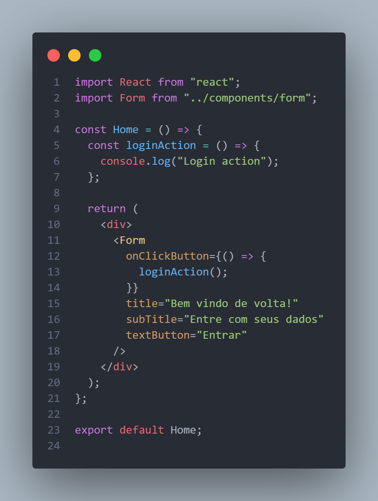
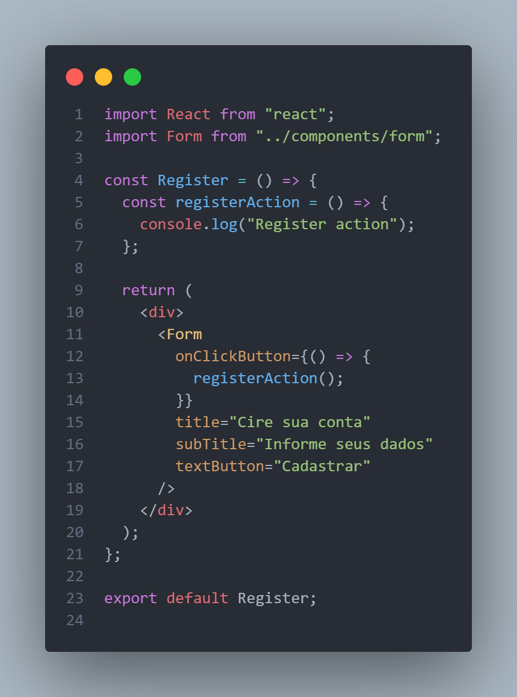

# Factory Method

## Histórico de Versionamento

| Data   | Versão | Descrição            | Autor(es)      | Revisor(es) |
| ------ | ------ | -------------------- | -------------- | ----------- |
| 05-Jan | 0.1    | Criação do documento | Eliás e Arthur | João Paulo  |
| 06-Jan | 0.2    | Revisão do documento | João Paulo     | -           |

## Introdução

O Factory Method é um padrão criacional de projeto que fornece uma interface para criar objetos em uma superclasse, mas permite que as subclasses alterem o tipo de objetos que serão criados [Factory].

O principal problema que o Factory Method procura solucionar é a extensibilidade. Ele é frequentemente usados ​​em aplicações que lidam com objetos que são diferentes, mas ao mesmo tempo possuem características (ou seja, propriedades) em comum.

## Utilização

Uma forma de utilizar este padrão dentro do projeto E-Rifas é na seção de criação de formulários no Front-End, onde através do fornecimento de informações para o componente, o mesmo é capaz de alterar os campos de input da interface.

A imagem a baixo mostra como foi o desenvolvimento deste padrão criação no projeto da equipe.

## Conclusão

Percebe-se que o uso deste padrão de projeto colabora para a componentização da aplicação no Front-End, evitando a replicação de código.

## Referências

- Factory Method. Disponível em: https://refactoring.guru/pt-br/design-patterns/factory-method. Acesso em: 05 de Janeiro de 2023
