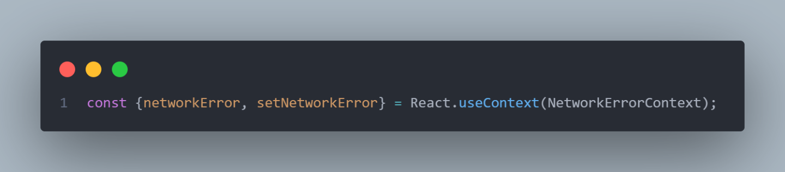

# Singleton

## Histórico de Versionamento

 Data | Versão | Descrição | Autor(es) | Revisor(es) 
 --- | --- | --- | --- | ---
 05-Jan | 0.1 | Criação do documento | Eliás e Arthur | Indefinido

## Introdução

O Singleton é um padrão de projeto criacional que permite você garantir que uma classe tenha apenas uma instância, enquanto provê um ponto de acesso global para essa instância. Dessa forma é possível controlar o acesso aos dados dessa classe compartilhada, com acesso global.

Associando ao projeto, utilizaremos no front-end a Context API. 

A ContextAPI proporciona a transmissão de dados, sem a necessidade de aninhamento de componentes. É um gerenciador global de estados e funções para componentes React, que necessitam de dados comuns, como autenticação de usuário, tema da aplicação, ou a língua escolhida. Ele evita um problema comum no React, passar propriedades por várias folhas da árvore de componente até o elemento desejado. Também pode ser útil se o componente filho quiser passar algum valor para o componente pai.

## Utilização

O uso da Api se da da seguinte forma

Após, é necessário criar o provider desse Context. Na propriedade values, será disponibilizado os atributos que serão globais

Após isso, é possível utilizar os dados disponíveis através do useHook "useContext"

## Conclusão

Dessa forma, o ContextApi do react utiliza os principios do singleton, uma vez que possui uma "instância de classe" global única, que será capaz de transmitir os dados para toda aplicação.

## Referências
* Singleton. Disponível em: https://refactoring.guru/pt-br/design-patterns/singleton. Acesso em: 05 de Janeiro de 2023