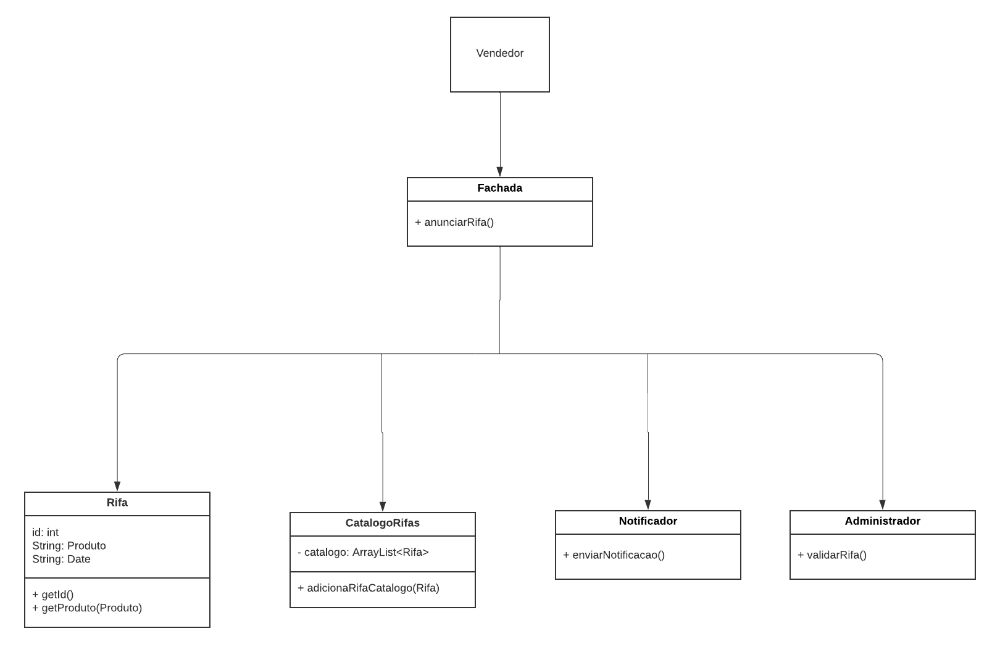
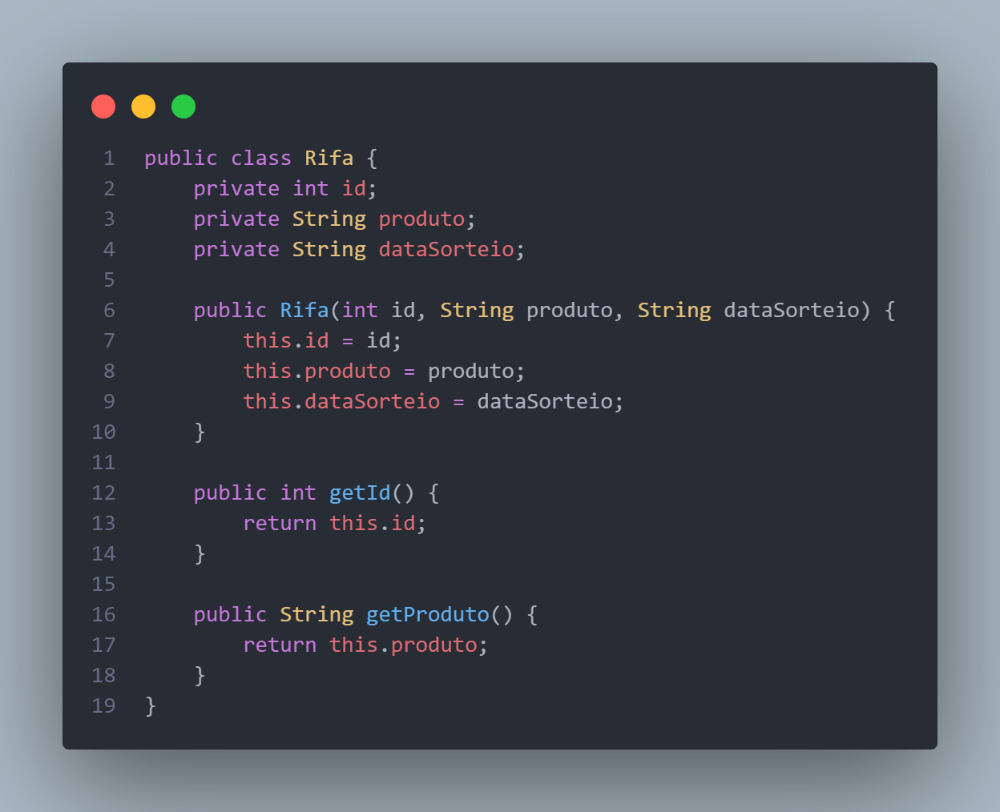
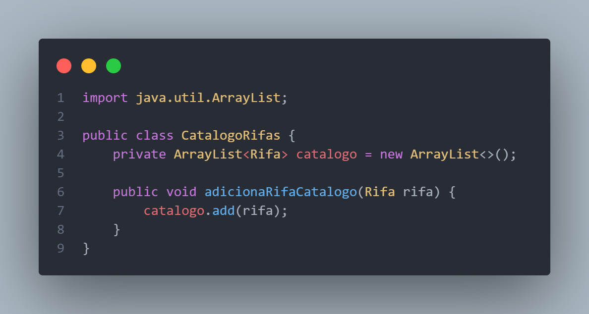
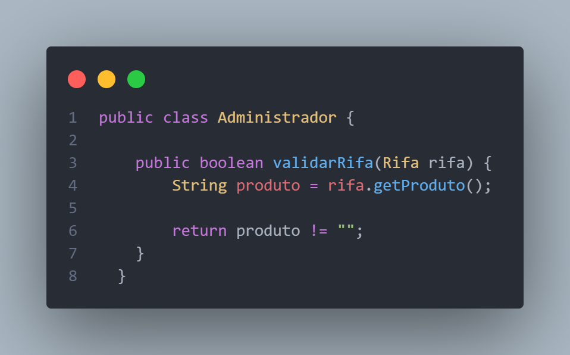
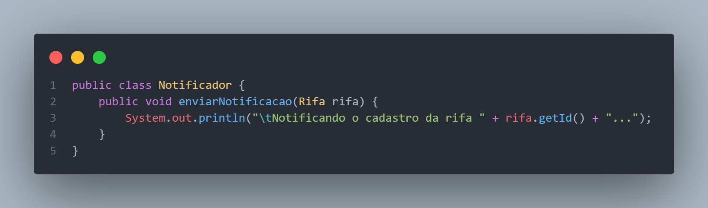
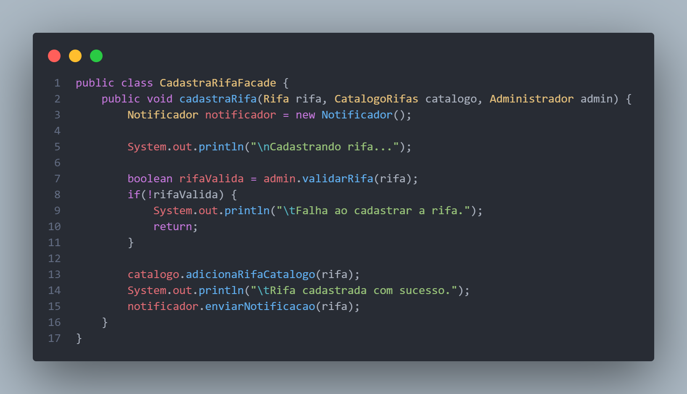
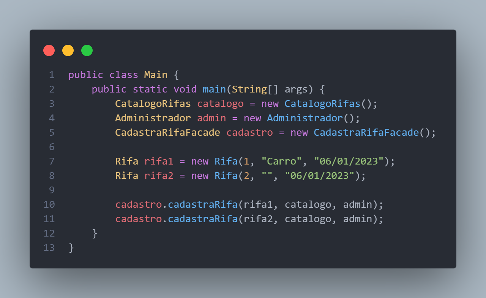

# Facade

## Histórico de Versões

| Data       | Versão | Descrição                         | Autor(es)        | Revisor(es)     |
| ---------- | ------ | --------------------------------- | ---------------- | --------------- |
| 05/01/2023 | 1.0    | Criação do documento              | Marcos Cabeceira | Karla Feliciano |
| 05/01/2023 | 2.0    | Inclusão de exemplos de aplicação | Karla Feliciano  |                 |

## Participantes do artefato

- Marcos Cabeceira
- Karla Feliciano

## Introdução

O padrão Facade é um padrão de design de software que visa fornecer uma interface simplificada para um sistema complexo. Ele pode ser usado para esconder a complexidade de um sistema e fornecer uma interface mais simples para os usuários.

Aqui está um exemplo de como o padrão Facade poderia ser implementado em Java:

```java
public class Facade {
  private Subsystem1 subsystem1;
  private Subsystem2 subsystem2;

  public Facade() {
    subsystem1 = new Subsystem1();
    subsystem2 = new Subsystem2();
  }

  public void operation1() {
    subsystem1.operation1();
    subsystem2.operation1();
  }

  public void operation2() {
    subsystem1.operation2();
    subsystem2.operation2();
  }
}

class Subsystem1 {
  public void operation1() {
    // Implementação da operação 1 do subsistema 1
  }

  public void operation2() {
    // Implementação da operação 2 do subsistema 1
  }
}

class Subsystem2 {
  public void operation1() {
    // Implementação da operação 1 do subsistema 2
  }

  public void operation2() {
    // Implementação da operação 2 do subsistema 2
  }
}
```

O Facade expõe dois métodos públicos: operation1 e operation2. Esses métodos são a interface simplificada para o sistema complexo composto pelos subsistemas Subsystem1 e Subsystem2. Eles encapsulam a lógica mais complexa que está sendo executada pelos subsistemas e fornecem uma interface mais simples para os usuários do sistema.

Para usar o sistema, um usuário pode criar uma instância do Facade Facade e chamar os métodos públicos nele. Por exemplo:

```java
Facade facade = new Facade();
facade.operation1();
facade.operation2();
```

## Problema

Imagine que você deve fazer seu código funcionar com vários objetos e que podem vir de bibliotecas sofisticadas e complexas. Levando isso em consideração você teria que inicializar todos esses objetos, executar métodos em uma ordem específica, etc. Nesse cenário a lógica das classes acabaria muito acoplada às bibliotecas de terceiros, entre outros problemas.

## Solução

O padrão Facade disponibiliza uma interface simples para um sistema complexo, onde você pode ter um uso limitado de uma biblioteca maior.

## Aplicação no projeto

### Exemplo 1

No nosso sistema, e-Rifas, um exemplo do Facade seria:

```java
public class RaffleFacade {
  private TicketSystem ticketSystem;
  private PrizePool prizePool;
  private RandomNumberGenerator randomNumberGenerator;

  public RaffleFacade() {
    ticketSystem = new TicketSystem();
    prizePool = new PrizePool();
    randomNumberGenerator = new RandomNumberGenerator();
  }

  public void buyTicket(String name) {
    ticketSystem.addTicket(name);
  }

  public void addPrize(String prize) {
    prizePool.addPrize(prize);
  }

  public String drawWinner() {
    List<String> tickets = ticketSystem.getAllTickets();
    int winningTicket = randomNumberGenerator.generate(tickets.size());
    return tickets.get(winningTicket);
  }
}

class TicketSystem {
  private List<String> tickets;

  public TicketSystem() {
    tickets = new ArrayList<>();
  }

  public void addTicket(String name) {
    tickets.add(name);
  }

  public List<String> getAllTickets() {
    return tickets;
  }
}

class PrizePool {
  private List<String> prizes;

  public PrizePool() {
    prizes = new ArrayList<>();
  }

  public void addPrize(String prize) {
    prizes.add(prize);
  }
}

class RandomNumberGenerator {
  public int generate(int max) {
    return new Random().nextInt(max);
  }
}
```

Para usar o sistema de rifas, um usuário pode criar uma instância do Facade RaffleFacade e chamar os métodos públicos nele. Por exemplo:

```java
RaffleFacade raffle = new RaffleFacade();

// Compre um ingresso com o nome "John"
raffle.buyTicket("John");

// Adicione um prêmio de "Livro de receitas de bolo"
raffle.addPrize("Livro de receitas de bolo");

// Sorteie um vencedor
String winner = raffle.drawWinner();
```

### Exemplo 2

Outra aplicação possível no projeto é no cadastro de rifas, onde é necessário atualizar e realizar ações em outras partes do sistema, elevando a complexidade para o usuário. Para resolver isso, uma alternativa seria acoplar todos essas subsistemas em uma só Fachada, como exemplificado a seguir.

<center>

|     |
| :-----------------------------------------------------------: |
| Figura 1: Diagrama da aplicação do Facade. <br/> Autor: Karla |

</center>

<center>

|  |
| :----------------------------------------------------: |
|  Figura 2: Código da classe Rifa. <br/> Autor: Karla   |

</center>

<center>

|  |
| :------------------------------------------------------------: |
|  Figura 3: Código da classe CatalogoRifas. <br/> Autor: Karla  |

</center>

<center>

|  |
| :--------------------------------------------------------------: |
|   Figura 4: Código da classe Administrador. <br/> Autor: Karla   |

</center>

<center>

|    |
| :--------------------------------------------------------: |
| Figura 5: Código da classe Notificador. <br/> Autor: Karla |

</center>

<center>

|  |
| :---------------------------------------------------------: |
|   Figura 6: Código da classe Fachada. <br/> Autor: Karla    |

</center>

Classe main para testar o código:

<center>

|    |
| :-------------------------------------------------: |
| Figura 7: Código da classe Main. <br/> Autor: Karla |

</center>

## Referências

- Observer Pattern - https://refactoring.guru/pt-br/design-patterns/facade
- Façade Teoria e Prática - Padrões de Projeto - https://youtu.be/A7mNiaBACYs
