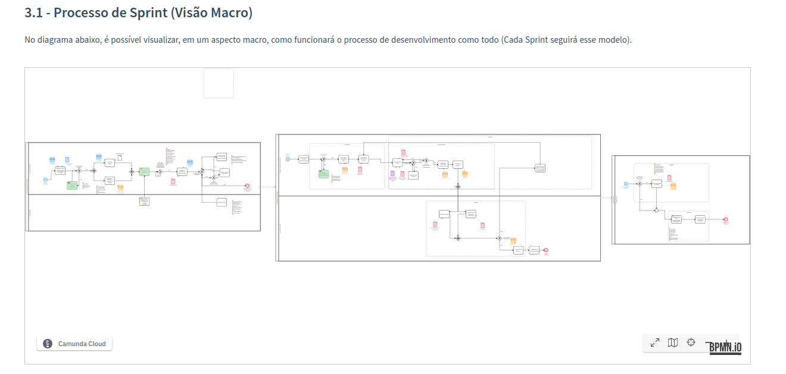
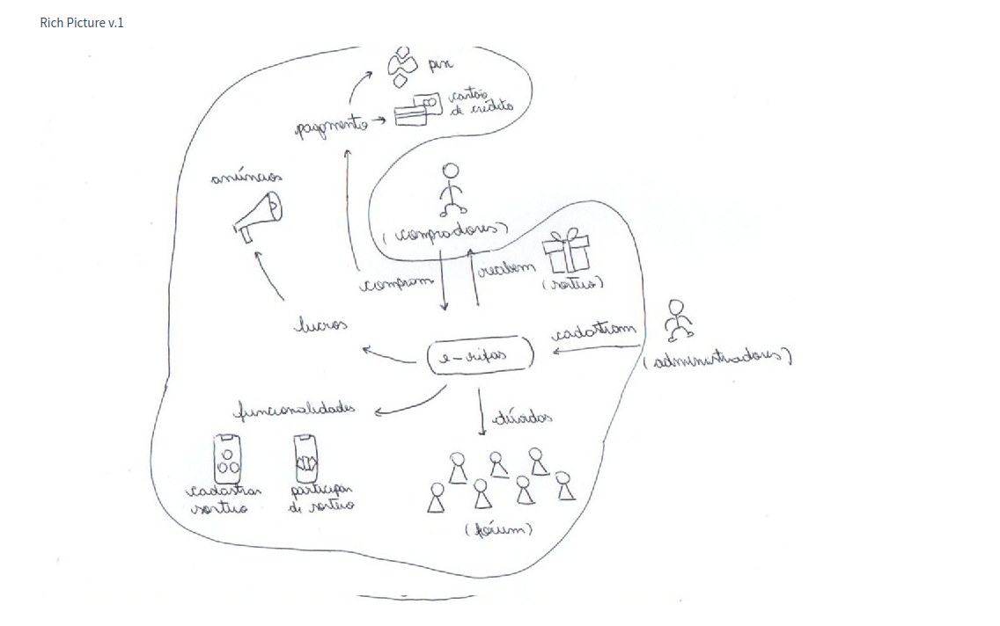
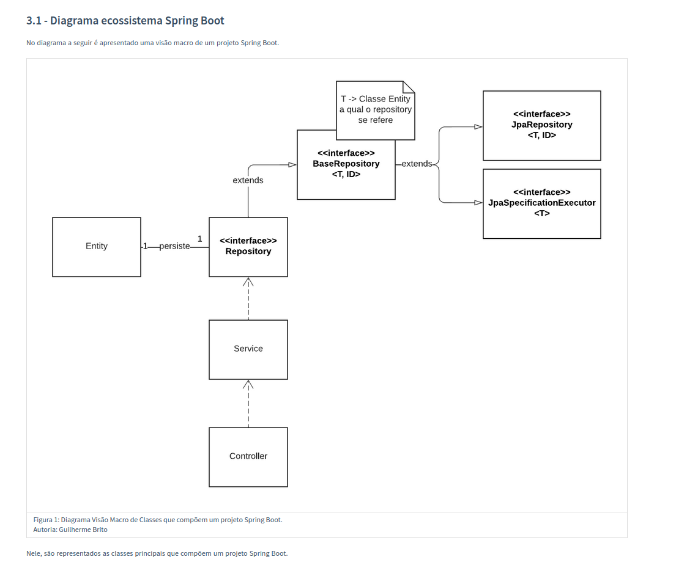
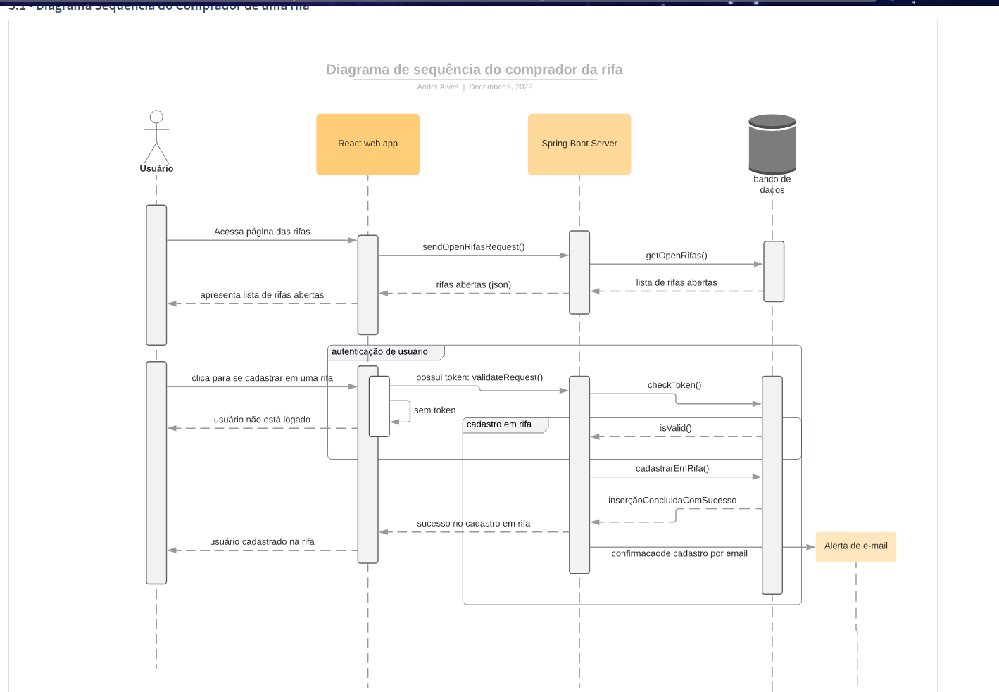
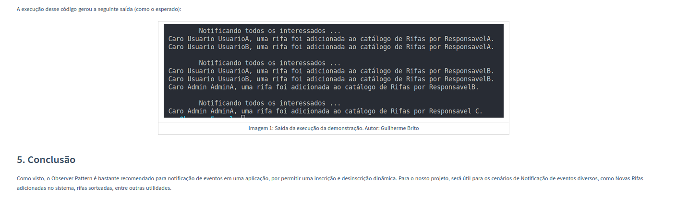
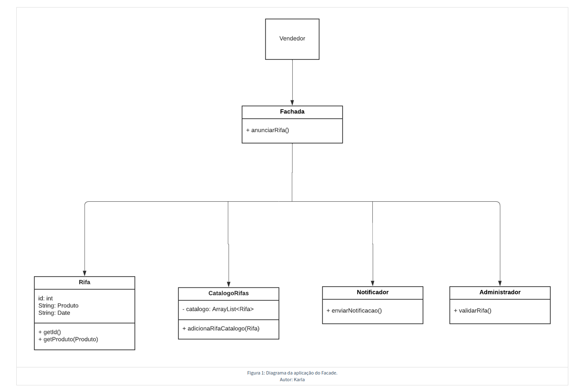
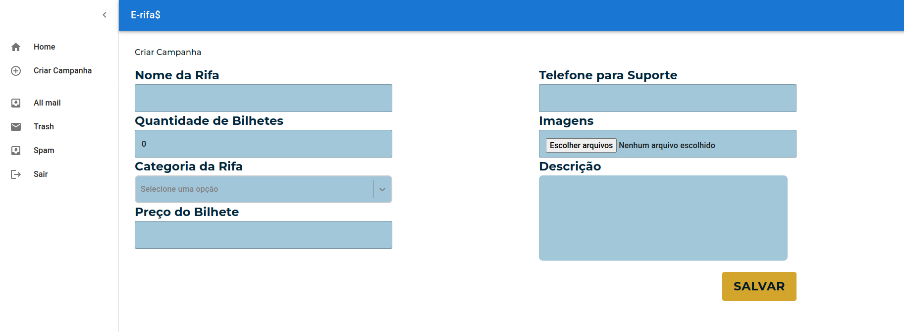
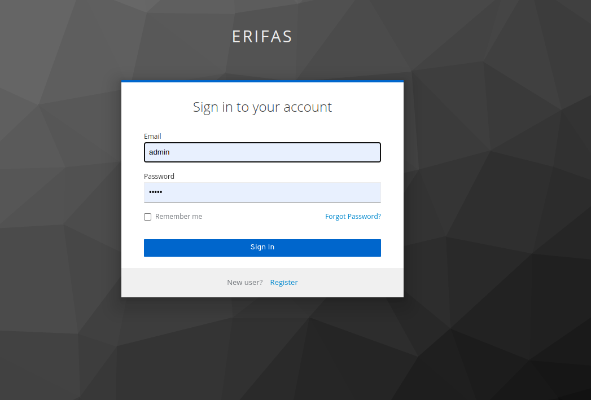

# e-Rifas

**Código da Disciplina**: FGA0208 
**Número do Grupo**: 02 

## Alunos

<table>
  <tr>
    <td align="center"><a href="https://github.com/dev-brito"> <b>Guilherme Brito - 19/0108011 </b></a> 
    <td align="center"><a href="https://github.com/Lucaspimentel123"> <b>Lucas Pimentel - 19/0016663 </b></a> 
    <td align="center"><a href="https://github.com/jpaulohe4rt"> <b>João Paulo Lima - 19/0030755</b></a> 
    <td align="center"><a href="https://github.com/KarlaCSF"> <b>
Karla Feliciano</b></a> 
  </tr>
    <tr>
    <td align="center"><a href="https://github.com/EuricoAbreu"> <b> 
Eurico Abreu</b></a> 
    <td align="center"><a href="https://github.com/jackesfonseca"> <b>Jackes da Fonseca</b></a> 
    <td align="center"><a href="https://github.com/andremralves"> <b>André Alves</b></a> 
    <td align="center"><a href="https://github.com/ArthurMeloG"> <b>
Arthur Melo</b></a> 
  </tr>
      <tr>
    <td align="center"><a href="https://github.com/Foxtrot40"> <b>Marcos Cabeceira</b></a> 
    <td align="center"><a href="https://github.com/ErickMVdO"> <b>Erick Melo</b></a> 
    <td align="center"><a href="https://github.com/eliasyousef00"> <b>
Eliás Yousef</b></a> 
  </tr>
</table>

## Sobre

O e-rifas foi pensado para que organizadores e compradores de rifas possam ser integrados em uma plataforma unificada.
Nela, organizadores podem compartilhar os seus sorteios e compradores podem buscar por esses sorteios abertos e
consequentemente efetuar a compra dessas rifas.

## Screenshots Primeira Entrega <<FOCO: DSW(Base)>>

## Screenshots Segunda Entrega <<FOCO: DSW(Modelagem)>>

## Screenshots Terceira Entrega <<FOCO: DSW(Padrões de Projeto)>>

## Screenshots Quarta Entrega (FINAL) <<FOCOS: Arquitetura & Reutilização de Software & PROJETO FINAL>>

## Descritivo dos Principais Aspectos Técnicos

**Principal(is) Metodologia(s) Adotada(s)**: Kanban Board, Scrum 
**Principais Linguagens Utilizadas e/ou Pretendidas**: Java no Backend e Typescript no Frontend 
**Principais Tecnologias Utilizadas e/ou Pretendidas**: Spring Boot no Backend e React no Frontend 
**Principal(is) Estilo(s) Arquitetural(is) Adotado(s)**: MVC, Cliente-Servidor 

## O Projeto está rodando?

(X) SIM
( ) NÃO
Se SIM, insira um manual (ou um script) para auxiliar ainda mais os interessados em consultar o projeto.

### Instruções para a execução do projeto

#### 1. Início de ambiente com Docker Compose

Executar o comando no terminal `docker-compose up -d` no diretório ambiente do repositório do Backend ou se preferir execute o comando `make up` na raiz do projeto.

#### 2. Início da Aplicação - Backend

Executar o comando ``./mvnw spring-boot:run`` no diretório raiz do backend. Esse comando inicializará a aplicação Spring
Boot.

#### 3. Início da Aplicação - Frontend

Executar o comando ``npm run start`` no diretório my-app do repositório do Frontend. Este comando será responsável pela
execução de um servidor de desenvolvimento para servir a aplicação React.

## Informações Complementares

Quaisquer outras informações sobre seu projeto podem ser descritas nessa seção.
