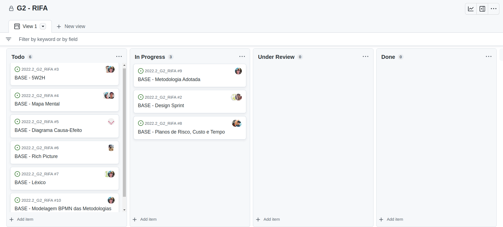

# 1.2. Módulo Processos/Metodologias/Abordagens

### Participantes do Artefato

- Guilherme Brito

### 1. Introdução

Este documento tem por objetivo apresentar e descrever todas as metodologias adotadas durante o ciclo de desenvolvimento
do Projeto, seja desde a fase de concepção à sua implementação. Aqui serão descritos os métodos e ferramentas adotadas.

### 2. Metodologias Adotados

Após uma reunião realizada no dia 11 de Novembro com a presença da maioria dos membros decidiu-se pela utilização de
conceitos advindos de **Metodologias Ágeis**.
A escolha se deu devido à familiaridade do grupo com essas técnicas que serão descritas abaixo.

#### 2.1 - Kanban

Kanban é um sistema visual de gestão de trabalho, que busca conduzir cada tarefa por um fluxo predeterminado de
trabalho.[1]
Em geral, o conceito de Kanban pode ser definido pelos seguintes itens:

- O sistema **visual**: um processo, definido em um quadro com colunas de separação, que permite dividir o trabalho em
  segmentos ou pelo seu status.
- Cartões: Descrevem o trabalho real que transita por este processo.

Neste trabalho utilizamos da ferramenta Github que apresenta a funcionalidade Projects. Nela, podemos construir
visualizações tomando Issues como Base.

O quadro foi construído tomando as colunas mais comuns utilizadas e pode ser visualizado na figura abaixo.

|      |
|:--------------------------------------------:|
| Figura 1 : Kanban Board Utilizado no Projeto |

## Referências

- [1] - **O que é Kanban?** Disponível em: https://www.totvs.com/blog/negocios/kanban/

## Histórico de Versões

| Data | Versão | Descrição | Autor(es) |
|------|--------|-----------|-----------|
|      |        |           |           |
